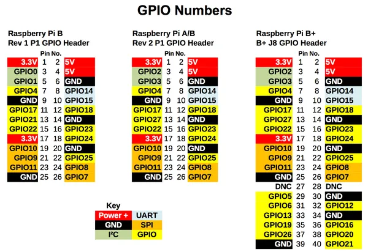

# Model B revisions and 40-pin header comparison

**Raspberry Pi** · Raspberry Pi SBC

Revision: Historical B Rev1, A/B Rev2 and B+ header comparison

Coverage: Pinout image collected

[Browse all manufacturers](../../../../BROWSE.md) · [Devices & IoT](../../../../DEVICES.md) · [Open in the browser guide](https://valleytech-black-wire-guide.pages.dev/?board=raspberry-pi-raspberry-pi-sbc-model-b-revisions-and-40-pin-header-comparison)

Architecture: **ARM**

## Physical GPIO header comparison

**pinout image** · Reviewed source · PNG

[Open original reference](../../../../library/media/dcf9b568e91a09189d2f0d6cf8a9ea19d388c462e1e6a185d1a05afe6f7409a7.png)

**Credit and rights:** Not established; source attribution retained. Source/manufacturer: Raspberry Pi.

[Source 1](https://cdn-learn.adafruit.com/assets/assets/000/075/713/original/learn_raspberry_pi_A0FA06AC-E081-4423-A3C8-94B9CAA1C658.png?1558108872) · [Source 2](https://learn.adafruit.com/adafruits-raspberry-pi-lesson-4-gpio-setup/the-gpio-connector)

Retain historical labels exactly as published. The B+ header marks pins 27 and 28 DNC; modern diagrams name their EEPROM ID functions. This is not a full alternate-function reference.

Image revision: Historical B Rev1, A/B Rev2 and B+ header comparison

SHA-256: `dcf9b568e91a09189d2f0d6cf8a9ea19d388c462e1e6a185d1a05afe6f7409a7`

Pin assignments have not been independently electrically verified. Check board revision before wiring.
