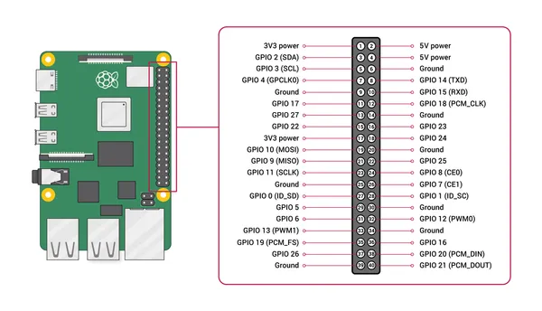

# Raspberry Pi 4 Model B

**Raspberry Pi** · Raspberry Pi SBC

Revision: Not identified

Coverage: Pinout image collected

[Browse all manufacturers](../../../../BROWSE.md) · [Devices & IoT](../../../../DEVICES.md) · [Open in the browser guide](https://valleytech-black-wire-guide.pages.dev/?board=raspberry-pi-raspberry-pi-sbc-4-model-b)

Architecture: **ARM**

## 40-pin GPIO header

**pinout image** · Reviewed source · PNG

[Open original reference](../../../../library/media/4cf35f3e8d37f79acfc8cb2d558ca7bfeec6c8474fc53e529aaa47032c94ca00.png)

**Credit and rights:** Not recorded by source. Source/manufacturer: Raspberry Pi.

[Source 1](https://www.raspberrypi.com/documentation/computers/images/GPIO-Pinout-Diagram-2.png?hash=df7d7847c57a1ca6d5b2617695de6d46) · [Source 2](https://www.raspberrypi.com/documentation/computers/raspberry-pi.html#gpio-and-the-40-pin-header) · [Source 3](https://www.waveshare.com/wiki/Raspberry_Pi_4_Model_B)

Official Raspberry Pi GPIO diagram depicting the Pi 4 board layout. Covers the 40-pin header only.

Image revision: Not identified

SHA-256: `4cf35f3e8d37f79acfc8cb2d558ca7bfeec6c8474fc53e529aaa47032c94ca00`

Pin assignments have not been independently electrically verified. Check board revision before wiring.
