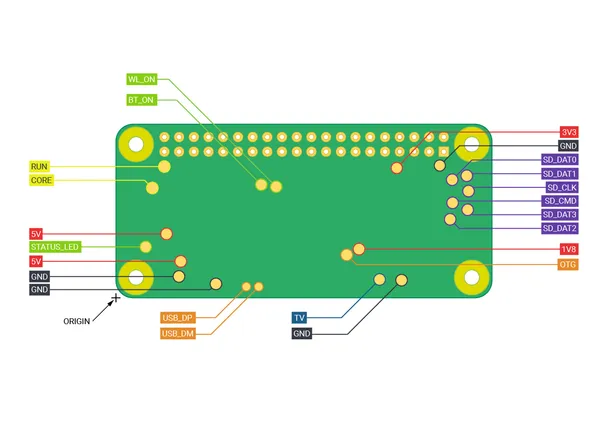

# Raspberry Pi Zero 2 W

**Raspberry Pi** · Raspberry Pi SBC

Revision: Not identified

Coverage: Partial pinout collected; full reference still needed

[Browse all manufacturers](../../../../BROWSE.md) · [Devices & IoT](../../../../DEVICES.md) · [Open in the browser guide](https://valleytech-black-wire-guide.pages.dev/?board=raspberry-pi-raspberry-pi-sbc-zero-2-w)

Architecture: **ARM**

## Underside test-pad labels

**pinout image** · Reviewed source · PNG

[Open original reference](../../../../library/media/46859f2d2d9bc25b3036990332e77c97ca9dcd038fc637206565eaf5395d2a68.png)

**Credit and rights:** Not established; source attribution retained. Source/manufacturer: Raspberry Pi.

[Source 1](https://raw.githubusercontent.com/raspberrypi/documentation/34dfb87309abda0c73e8cbc454f999fd8eaca73f/documentation/asciidoc/computers/raspberry-pi/images/zero2-pad-diagram.png) · [Source 2](https://github.com/raspberrypi/documentation/blob/34dfb87309abda0c73e8cbc454f999fd8eaca73f/documentation/asciidoc/computers/raspberry-pi/images/zero2-pad-diagram.png)

Original image from the manufacturer documentation repository; exact commit recorded in source URL. Supplemental underside pad map; main GPIO header reference is filed separately.

Image revision: Not identified

SHA-256: `46859f2d2d9bc25b3036990332e77c97ca9dcd038fc637206565eaf5395d2a68`

Pin assignments have not been independently electrically verified. Check board revision before wiring.
