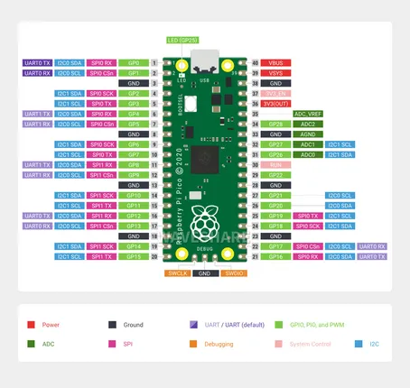
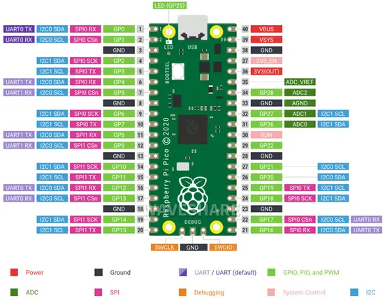
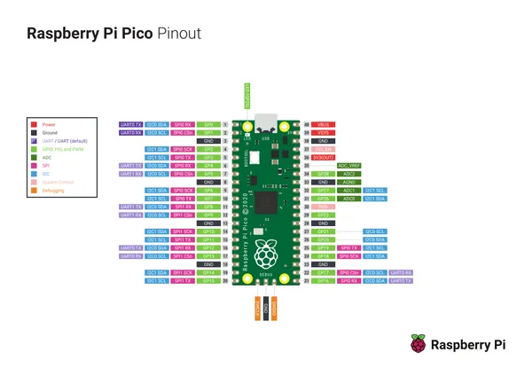
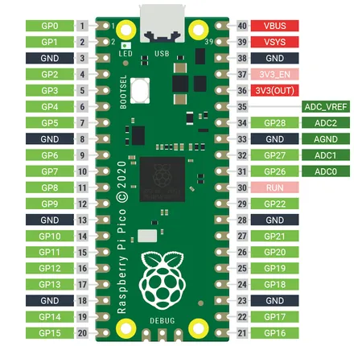

# Raspberry Pi Pico

**Raspberry Pi** · RP2040

Revision: Not identified  
Coverage: Pinout image collected

[Browse all manufacturers](../../../../BROWSE.md) · [Desktop app](https://github.com/valleytechsolutions/black-wire-desktop)

## Pinout

**pinout image** · Reviewed source · JPG

[Open original reference](../../../../library/media/60c2ed518dc771533a0c1d048eb7462d82c00ecb61fec89dbd037986613f9c7f.jpg)

**Credit and rights:** Not recorded; retain original attribution. Source/manufacturer: Raspberry Pi.

[Source 1](https://www.waveshare.com/img/devkit/Raspberry-Pi-Pico/Raspberry-Pi-Pico-details-5.jpg) · [Source 2](https://www.waveshare.com/raspberry-pi-pico.htm)

SHA-256: `60c2ed518dc771533a0c1d048eb7462d82c00ecb61fec89dbd037986613f9c7f`

## Pinout

**pinout image** · Reviewed source · JPG

[Open original reference](../../../../library/media/5a7e47bc5e3251bb40900508e44f56a523efe21b4180230a740eae6d986c01ea.jpg)

**Credit and rights:** Not recorded; retain original attribution. Source/manufacturer: Raspberry Pi.

[Source 1](https://www.waveshare.com/w/upload/0/00/Pico-R3-Pinout02.jpg) · [Source 2](https://www.waveshare.com/wiki/Raspberry_Pi_Pico)

SHA-256: `5a7e47bc5e3251bb40900508e44f56a523efe21b4180230a740eae6d986c01ea`

## Pinout reference - PDF page 1

**pinout image** · Reviewed source · PNG

[Open original reference](../../../../library/media/93ff72b0a60a69da63bb0b27ae4a2112fa38064e69f3c5d9436d6640306ace45.png)

**Credit and rights:** Not established; source attribution retained. Source/manufacturer: Raspberry Pi.

[Source 1](https://cdn-shop.adafruit.com/product-files/4864/4864_Pico-R3-A4-Pinout.pdf) · [Source 2](https://www.adafruit.com/product/4864) · [Source 3](https://www.adafruit.com/product/4883)

Discovered from CircuitPython board metadata and the linked product/documentation page. Exact hardware revision requires matching to the diagram. Original PDF page 1 rendered at 220 dpi; no labels changed.

SHA-256: `93ff72b0a60a69da63bb0b27ae4a2112fa38064e69f3c5d9436d6640306ace45`

## Pinout - Nologo documentation

**pinout image** · Reviewed source · PNG

[Open original reference](../../../../library/media/96396793c1e6bc3a95f323c315229c9c7a4700fe73affda89fc1f6711e529d26.png)

**Credit and rights:** Not established; source attribution retained. Source/manufacturer: Raspberry Pi.

[Source 1](https://www.nologo.tech/assets/img/raspberrypie/RP2040Pico/rp2040foot.png) · [Source 2](https://www.nologo.tech/product/raspberrypie/RP2040/RP2040Pico.html)

Nologo documentation explicitly identifies the official Raspberry Pi Pico. Source image is kept unchanged. This is not attributed to Nologo as board manufacturer.

SHA-256: `96396793c1e6bc3a95f323c315229c9c7a4700fe73affda89fc1f6711e529d26`

## Physical board pinout

**original reference PDF** · Reviewed source · PDF

[Open original reference](../../../../library/media/a2722b88bd6ed36ee6225890fd35c220648530312eb516ba44cba1112f839a28.pdf)

**Credit and rights:** Not established; source attribution retained. Source/manufacturer: Raspberry Pi.

[Source 1](https://cdn-shop.adafruit.com/product-files/4864/4864_Pico-R3-A4-Pinout.pdf) · [Source 2](https://www.adafruit.com/product/4864) · [Source 3](https://www.adafruit.com/product/4883)

Discovered from CircuitPython board metadata and the linked product/documentation page. Exact hardware revision requires matching to the diagram.

SHA-256: `a2722b88bd6ed36ee6225890fd35c220648530312eb516ba44cba1112f839a28`

Pin assignments have not been independently electrically verified. Check board revision before wiring.
