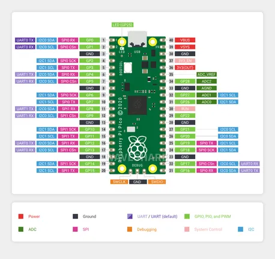

# Raspberry Pi Pico H

**Raspberry Pi** · RP2040

Revision: Not identified  
Coverage: Pinout image collected

[Browse all manufacturers](../../../../BROWSE.md) · [Desktop app](https://github.com/valleytechsolutions/black-wire-desktop)

## Pinout

**pinout image** · Reviewed source · JPG

[Open original reference](../../../../library/media/e0ead617229f1aff23932ec6d5047bcf78f3b798145deaca286ec8ef5689adaa.jpg)

**Credit and rights:** Not recorded; retain original attribution. Source/manufacturer: Raspberry Pi.

[Source 1](https://www.waveshare.com/img/devkit/Raspberry-Pi-Pico-H/Raspberry-Pi-Pico-H-details-7.jpg) · [Source 2](https://www.waveshare.com/raspberry-pi-pico-h.htm)

SHA-256: `e0ead617229f1aff23932ec6d5047bcf78f3b798145deaca286ec8ef5689adaa`

Pin assignments have not been independently electrically verified. Check board revision before wiring.
