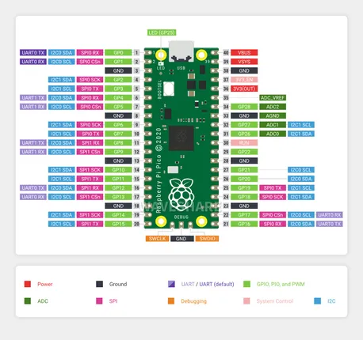

# Raspberry Pi Pico H

**Raspberry Pi** · RP2040

Revision: Not identified

Coverage: Pinout image collected

[Browse all manufacturers](../../../../BROWSE.md) · [Devices & IoT](../../../../DEVICES.md) · [Open in the browser guide](https://valleytech-black-wire-guide.pages.dev/?board=raspberry-pi-rp2040-pico-h)

## Datasheets and original documentation

Board datasheet: **not yet recorded**. Visual reference: **available**.

Original manufacturer website still needs identification.

A chip datasheet, schematic and board datasheet have different scopes. Match the exact hardware revision.

[Documentation coverage and remaining gaps](../../../../DOCUMENTATION.md)

## Pinout

**pinout image** · Reviewed source · JPG

[Open original reference](../../../../library/media/e0ead617229f1aff23932ec6d5047bcf78f3b798145deaca286ec8ef5689adaa.jpg)

**Credit and rights:** Not recorded; retain original attribution. Source/manufacturer: Raspberry Pi.

[Source 1](https://www.waveshare.com/img/devkit/Raspberry-Pi-Pico-H/Raspberry-Pi-Pico-H-details-7.jpg) · [Source 2](https://www.waveshare.com/raspberry-pi-pico-h.htm)

Image revision: Not identified

SHA-256: `e0ead617229f1aff23932ec6d5047bcf78f3b798145deaca286ec8ef5689adaa`

Pin assignments have not been independently electrically verified. Check board revision before wiring.
