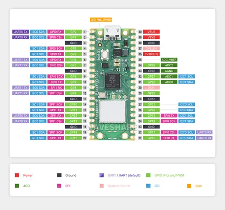
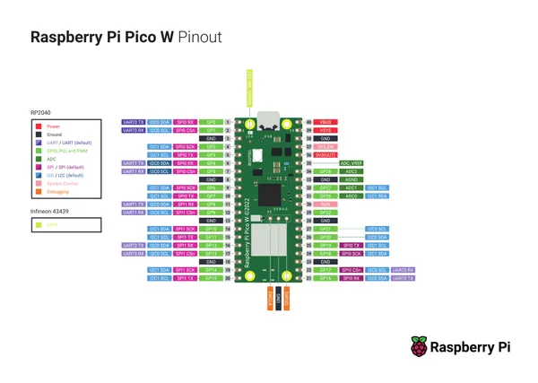

# Raspberry Pi Pico W

**Raspberry Pi** · RP2040

Revision: Not identified  
Coverage: Pinout image collected

[Browse all manufacturers](../../../../BROWSE.md) · [Desktop app](https://github.com/valleytechsolutions/black-wire-desktop)

## Pinout

**pinout image** · Reviewed source · JPG

[Open original reference](../../../../library/media/f88ae793dd5e70b79c39cf0d5bad1805d930fec19ae222c413c962ed5c60bf9e.jpg)

**Credit and rights:** Not recorded; retain original attribution. Source/manufacturer: Raspberry Pi.

[Source 1](https://www.waveshare.com/img/devkit/Raspberry-Pi-Pico-W/Raspberry-Pi-Pico-W-details-17.jpg) · [Source 2](https://www.waveshare.com/raspberry-pi-pico-w.htm)

SHA-256: `f88ae793dd5e70b79c39cf0d5bad1805d930fec19ae222c413c962ed5c60bf9e`

## Pinout

**pinout image** · Reviewed source · JPG

[Open original reference](../../../../library/media/37e347b23f157e8a61ff4aa66dfed703af62b8522994a75458efe26b3517059d.jpg)

**Credit and rights:** Not recorded; retain original attribution. Source/manufacturer: Raspberry Pi.

[Source 1](https://www.waveshare.com/w/upload/9/95/Raspberry_Pi_Pico_W_Manual01.jpg) · [Source 2](https://www.waveshare.com/wiki/Raspberry_Pi_Pico_W)

SHA-256: `37e347b23f157e8a61ff4aa66dfed703af62b8522994a75458efe26b3517059d`

## Pinout reference - PDF page 1

**pinout image** · Reviewed source · PNG

[Open original reference](../../../../library/media/69686a95e274921f9efa1f83eff9e587e86673d3dc1fad5f0912d9df9bed719d.png)

**Credit and rights:** Not established; source attribution retained. Source/manufacturer: Raspberry Pi.

[Source 1](https://cdn-shop.adafruit.com/product-files/5526/PicoW-A4-Pinout.pdf) · [Source 2](https://www.adafruit.com/product/5526)

Discovered from CircuitPython board metadata and the linked product/documentation page. Exact hardware revision requires matching to the diagram. Original PDF page 1 rendered at 220 dpi; no labels changed.

SHA-256: `69686a95e274921f9efa1f83eff9e587e86673d3dc1fad5f0912d9df9bed719d`

## Physical board pinout

**original reference PDF** · Reviewed source · PDF

[Open original reference](../../../../library/media/690e54a73e9b7bfe3c98a338a9e959ca2bb6fdda9ffc39727544c75b9d1c42a8.pdf)

**Credit and rights:** Not established; source attribution retained. Source/manufacturer: Raspberry Pi.

[Source 1](https://cdn-shop.adafruit.com/product-files/5526/PicoW-A4-Pinout.pdf) · [Source 2](https://www.adafruit.com/product/5526)

Discovered from CircuitPython board metadata and the linked product/documentation page. Exact hardware revision requires matching to the diagram.

SHA-256: `690e54a73e9b7bfe3c98a338a9e959ca2bb6fdda9ffc39727544c75b9d1c42a8`

Pin assignments have not been independently electrically verified. Check board revision before wiring.
