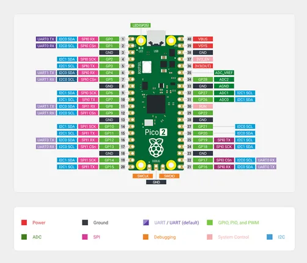
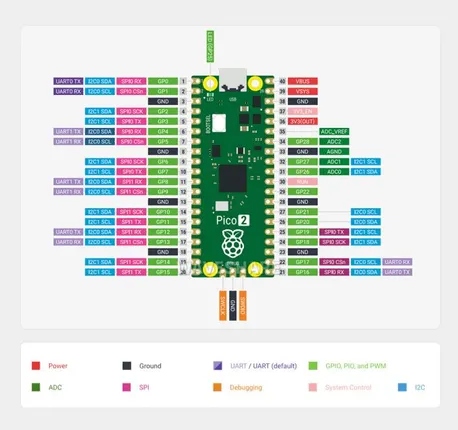

# Raspberry Pi Pico 2

**Raspberry Pi** · RP2350

Revision: Not identified  
Coverage: Pinout image collected

[Browse all manufacturers](../../../../BROWSE.md) · [Desktop app](https://github.com/valleytechsolutions/black-wire-desktop)

## Pinout

**pinout image** · Reviewed source · JPG

[Open original reference](../../../../library/media/b282f7e15b6e54ee43d814dac646b3e06296e8278c43347902ed2b0bbcb84464.jpg)

**Credit and rights:** Not recorded; retain original attribution. Source/manufacturer: Raspberry Pi.

[Source 1](https://www.waveshare.com/img/devkit/Raspberry-Pi-Pico-2/Raspberry-Pi-Pico-2-details-19.jpg) · [Source 2](https://www.waveshare.com/raspberry-pi-pico-2.htm)

SHA-256: `b282f7e15b6e54ee43d814dac646b3e06296e8278c43347902ed2b0bbcb84464`

## Pinout

**pinout image** · Reviewed source · JPG

[Open original reference](../../../../library/media/7a76a7c9233338ad3ba1ef07a65a778cb2b3d0bd2529468b963e6fad96e44ddb.jpg)

**Credit and rights:** Not recorded; retain original attribution. Source/manufacturer: Raspberry Pi.

[Source 1](https://www.waveshare.com/w/upload/1/19/Raspberry-Pi-Pico-2-details-19.jpg) · [Source 2](https://www.waveshare.com/wiki/Raspberry_Pi_Pico_2)

SHA-256: `7a76a7c9233338ad3ba1ef07a65a778cb2b3d0bd2529468b963e6fad96e44ddb`

Pin assignments have not been independently electrically verified. Check board revision before wiring.
