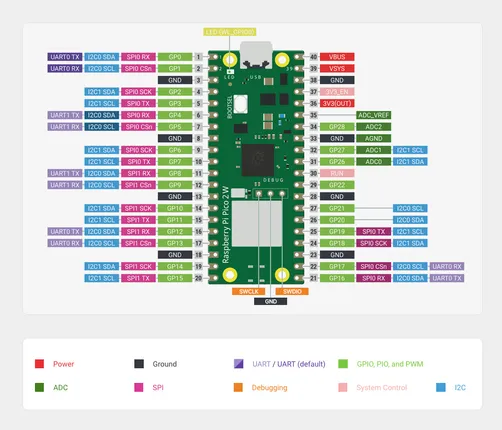
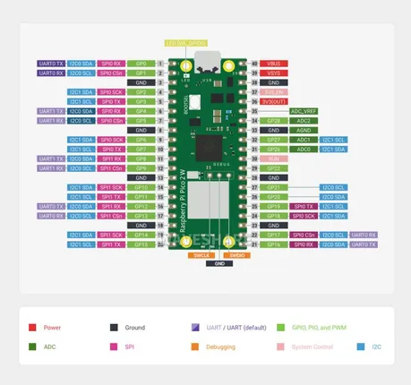
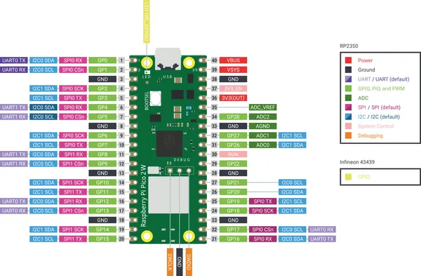

# Raspberry Pi Pico 2 W

**Raspberry Pi** · RP2350

Revision: Not identified  
Coverage: Pinout image collected

[Browse all manufacturers](../../../../BROWSE.md) · [Desktop app](https://github.com/valleytechsolutions/black-wire-desktop)

## Pinout

**pinout image** · Reviewed source · JPG

[Open original reference](../../../../library/media/79751a46e2bc60104b69d74d804497092511b800542ec3ca47d8b721f0b7c664.jpg)

**Credit and rights:** Not recorded; retain original attribution. Source/manufacturer: Raspberry Pi.

[Source 1](https://www.waveshare.com/img/devkit/Raspberry-Pi-Pico-2-W/Raspberry-Pi-Pico-2-W-details-19.jpg) · [Source 2](https://www.waveshare.com/raspberry-pi-pico-2-w.htm)

SHA-256: `79751a46e2bc60104b69d74d804497092511b800542ec3ca47d8b721f0b7c664`

## Pinout

**pinout image** · Reviewed source · JPG

[Open original reference](../../../../library/media/685dac648f63d6eceb421e6325d190509270a7fae64bcdf1dc54f368abf54239.jpg)

**Credit and rights:** Not recorded; retain original attribution. Source/manufacturer: Raspberry Pi.

[Source 1](https://www.waveshare.com/w/upload/a/ab/800px-Pico2w_pin_out.jpg) · [Source 2](https://www.waveshare.com/wiki/Raspberry_Pi_Pico_2_W)

SHA-256: `685dac648f63d6eceb421e6325d190509270a7fae64bcdf1dc54f368abf54239`

## Manufacturer board pinout

**pinout image** · Reviewed source · PNG

[Open original reference](../../../../library/media/5c9137245aa974c4ac3d0294b6e3ff697205bc874392a0ed739fc2ef99500c0c.png)

**Credit and rights:** Not established; source attribution retained. Source/manufacturer: Raspberry Pi.

[Source 1](https://raw.githubusercontent.com/raspberrypi/documentation/34dfb87309abda0c73e8cbc454f999fd8eaca73f/documentation/asciidoc/microcontrollers/pico-series/images/pico2w-pinout.png) · [Source 2](https://github.com/raspberrypi/documentation/blob/34dfb87309abda0c73e8cbc454f999fd8eaca73f/documentation/asciidoc/microcontrollers/pico-series/images/pico2w-pinout.png)

Original image from the manufacturer documentation repository; exact commit recorded in source URL.

SHA-256: `5c9137245aa974c4ac3d0294b6e3ff697205bc874392a0ed739fc2ef99500c0c`

Pin assignments have not been independently electrically verified. Check board revision before wiring.
