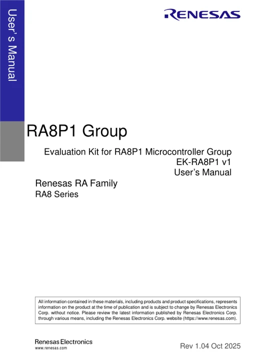
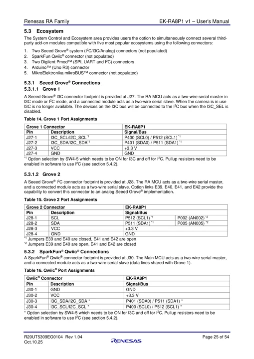
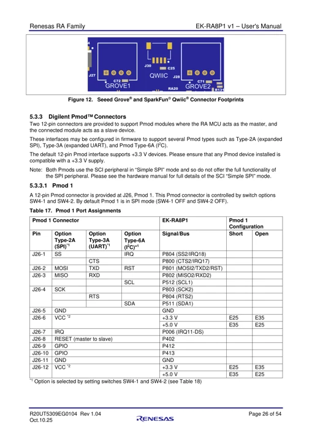
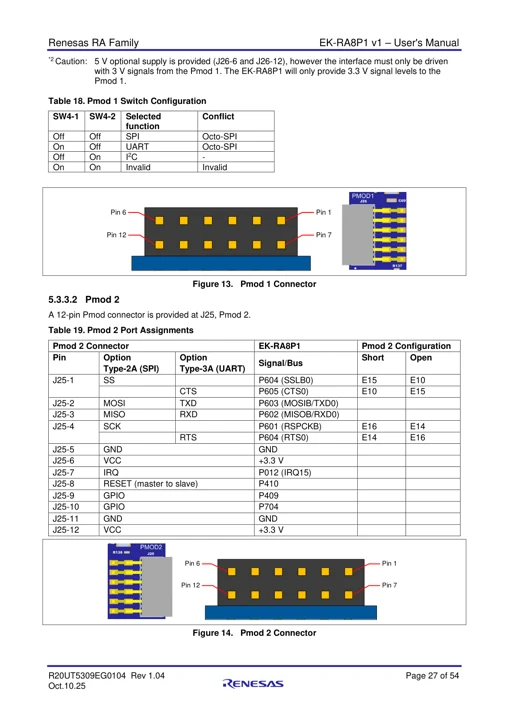
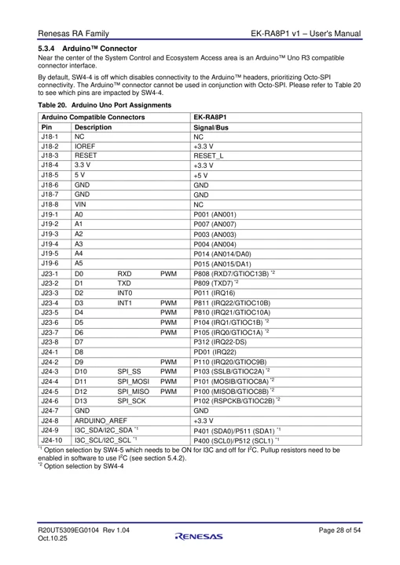
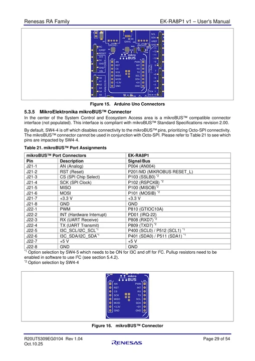
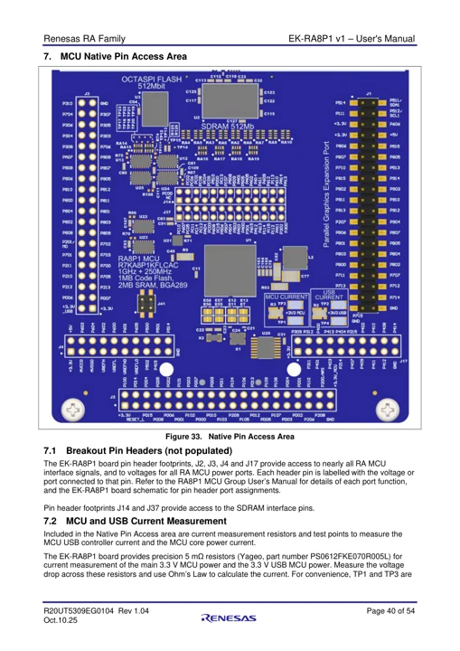

# EK-RA8P1 v1

**Renesas** · RA8P1

Revision: EK-RA8P1 v1; user manual Rev. 1.04 (2025-10-10)

Coverage: Manufacturer references reviewed by scope; independent electrical and all-connector review pending

[Browse all manufacturers](../../../../BROWSE.md) · [Devices & IoT](../../../../DEVICES.md) · [Open in the browser guide](https://valleytech-black-wire-guide.pages.dev/?board=renesas-ek-ra8p1-v1)

## Datasheets and original documentation

Board datasheet: **not yet recorded**. Visual reference: **available**.

[Manufacturer hardware documentation](https://www.renesas.com/en/design-resources/boards-kits/ek-ra8p1)

- **hardware-guide / board**: [EK-RA8P1 v1 User Manual](https://www.renesas.com/en/document/mat/ek-ra8p1-v1-users-manual) · [saved document](../../../../library/media/ac00c271931c806c1ad7e993a1a3cb9abcac89e10e8ee706bb1f8736ba8ebf8a.pdf)
- **hardware-guide / board**: [Manufacturer pin and hardware documentation](https://www.renesas.com/en/design-resources/boards-kits/ek-ra8p1) · online

A chip datasheet, schematic and board datasheet have different scopes. Match the exact hardware revision.

[Documentation coverage and remaining gaps](../../../../DOCUMENTATION.md)

## EK-RA8P1 v1 User Manual

**original reference PDF** · Source identity and visual scope inspected; PDF review covers first-page preview. Independent electrical and all-connector completeness review pending. · PDF

[Open original reference](../../../../library/media/ac00c271931c806c1ad7e993a1a3cb9abcac89e10e8ee706bb1f8736ba8ebf8a.pdf)

**Credit and rights:** Manufacturer artwork; reuse and print rights not established. Inclusion does not relicense the original.. Source/manufacturer: Renesas.

[Source 1](https://www.renesas.com/en/document/mat/ek-ra8p1-v1-users-manual) · [Source 2](https://www.renesas.com/en/design-resources/boards-kits/ek-ra8p1)

Manufacturer source retained unchanged. Source identity and visual scope inspected; PDF review covers first-page preview. Independent electrical and all-connector completeness review pending.

Image revision: As supplied in the original; match exact board revision

SHA-256: `ac00c271931c806c1ad7e993a1a3cb9abcac89e10e8ee706bb1f8736ba8ebf8a`

## EK-RA8P1 v1 connector reference - PDF page 29

**pin function reference** · Rendered page visually reviewed against the original; electrical and complete-device approval pending · PNG

[Open original reference](../../../../library/media/620379844e7d0b0f5d747de8e46a3d13f65308841553790395c30a850004a2aa.png)

**Credit and rights:** Manufacturer artwork; reuse and print rights not established. Inclusion does not relicense the original.. Source/manufacturer: Renesas.

[Source 1](https://www.renesas.com/en/document/mat/ek-ra8p1-v1-users-manual) · [Source 2](https://www.renesas.com/en/design-resources/boards-kits/ek-ra8p1)

Uncropped render of original PDF page 29. Connector scope is limited to this page. Read the original manual for switch/jumper configuration, unpopulated connectors and shared signals.

Image revision: As supplied in the original; match exact board revision

SHA-256: `620379844e7d0b0f5d747de8e46a3d13f65308841553790395c30a850004a2aa`

## EK-RA8P1 v1 connector reference - PDF page 30

**pin function reference** · Rendered page visually reviewed against the original; electrical and complete-device approval pending · PNG

[Open original reference](../../../../library/media/db617f060ecfe64d610ab2972236399b0ded5b1eec27a554fb1c26c3b56ba654.png)

**Credit and rights:** Manufacturer artwork; reuse and print rights not established. Inclusion does not relicense the original.. Source/manufacturer: Renesas.

[Source 1](https://www.renesas.com/en/document/mat/ek-ra8p1-v1-users-manual) · [Source 2](https://www.renesas.com/en/design-resources/boards-kits/ek-ra8p1)

Uncropped render of original PDF page 30. Connector scope is limited to this page. Read the original manual for switch/jumper configuration, unpopulated connectors and shared signals.

Image revision: As supplied in the original; match exact board revision

SHA-256: `db617f060ecfe64d610ab2972236399b0ded5b1eec27a554fb1c26c3b56ba654`

## EK-RA8P1 v1 connector reference - PDF page 31

**pin function reference** · Rendered page visually reviewed against the original; electrical and complete-device approval pending · PNG

[Open original reference](../../../../library/media/78187c2bba10841aa1ef580174f97ac32a56cd67d1d8768a7af15a96ff08a9fd.png)

**Credit and rights:** Manufacturer artwork; reuse and print rights not established. Inclusion does not relicense the original.. Source/manufacturer: Renesas.

[Source 1](https://www.renesas.com/en/document/mat/ek-ra8p1-v1-users-manual) · [Source 2](https://www.renesas.com/en/design-resources/boards-kits/ek-ra8p1)

Uncropped render of original PDF page 31. Connector scope is limited to this page. Read the original manual for switch/jumper configuration, unpopulated connectors and shared signals.

Image revision: As supplied in the original; match exact board revision

SHA-256: `78187c2bba10841aa1ef580174f97ac32a56cd67d1d8768a7af15a96ff08a9fd`

## EK-RA8P1 v1 connector reference - PDF page 32

**pin function reference** · Rendered page visually reviewed against the original; electrical and complete-device approval pending · PNG

[Open original reference](../../../../library/media/34ce5a1b099033a007e0ca12d771866c2155ae1578e3c72a0a73b70336274f4d.png)

**Credit and rights:** Manufacturer artwork; reuse and print rights not established. Inclusion does not relicense the original.. Source/manufacturer: Renesas.

[Source 1](https://www.renesas.com/en/document/mat/ek-ra8p1-v1-users-manual) · [Source 2](https://www.renesas.com/en/design-resources/boards-kits/ek-ra8p1)

Uncropped render of original PDF page 32. Connector scope is limited to this page. Read the original manual for switch/jumper configuration, unpopulated connectors and shared signals.

Image revision: As supplied in the original; match exact board revision

SHA-256: `34ce5a1b099033a007e0ca12d771866c2155ae1578e3c72a0a73b70336274f4d`

## EK-RA8P1 v1 connector reference - PDF page 33

**pin function reference** · Rendered page visually reviewed against the original; electrical and complete-device approval pending · PNG

[Open original reference](../../../../library/media/fc8f4b69afa9e59b837422f0726ef38fd1a5bf85c733c6a6b7d4228bd01bbe0f.png)

**Credit and rights:** Manufacturer artwork; reuse and print rights not established. Inclusion does not relicense the original.. Source/manufacturer: Renesas.

[Source 1](https://www.renesas.com/en/document/mat/ek-ra8p1-v1-users-manual) · [Source 2](https://www.renesas.com/en/design-resources/boards-kits/ek-ra8p1)

Uncropped render of original PDF page 33. Connector scope is limited to this page. Read the original manual for switch/jumper configuration, unpopulated connectors and shared signals.

Image revision: As supplied in the original; match exact board revision

SHA-256: `fc8f4b69afa9e59b837422f0726ef38fd1a5bf85c733c6a6b7d4228bd01bbe0f`

## EK-RA8P1 v1 connector reference - PDF page 44

**pinout image** · Rendered page visually reviewed against the original; electrical and complete-device approval pending · PNG

[Open original reference](../../../../library/media/eaa47d0428e916cf6f6c4e674f5a202daf0060fe5cdea95204d9cc317d3a60af.png)

**Credit and rights:** Manufacturer artwork; reuse and print rights not established. Inclusion does not relicense the original.. Source/manufacturer: Renesas.

[Source 1](https://www.renesas.com/en/document/mat/ek-ra8p1-v1-users-manual) · [Source 2](https://www.renesas.com/en/design-resources/boards-kits/ek-ra8p1)

Uncropped render of original PDF page 44. Connector scope is limited to this page. Read the original manual for switch/jumper configuration, unpopulated connectors and shared signals.

Image revision: As supplied in the original; match exact board revision

SHA-256: `eaa47d0428e916cf6f6c4e674f5a202daf0060fe5cdea95204d9cc317d3a60af`

Pin assignments have not been independently electrically verified. Check board revision before wiring.
