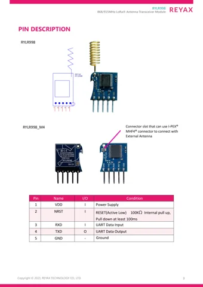

# RYLR998 UART LoRa transceiver module

**REYAX** · LoRa UART module

Revision: PCB revision not established

Coverage: Physical source pinout available; independent completeness review pending

[Browse all manufacturers](../../../../BROWSE.md) · [Devices & IoT](../../../../DEVICES.md) · [Open in the browser guide](https://valleytech-black-wire-guide.pages.dev/?board=reyax-rylr998)

## Datasheets and original documentation

Board datasheet: **recorded**. Visual reference: **available**.

[Original manufacturer / project documentation](https://reyax.com/upload/products_download/download_file/RYLR998_EN.pdf)

- **datasheet / board**: [RYLR998 manufacturer datasheet](https://reyax.com/upload/products_download/download_file/RYLR998_EN.pdf) · [saved document](../../../../library/media/b1da0023fd0f1b01f5624b1645c9e7a6948f2fd5979f9c4f17ace8e0e80c10e9.pdf)
- **product-page / distributor**: [Distributor discovery listing](https://www.voltaat.com/products/reyax-rylr998-lora-transceiver-module) · online

Source identity and visual scope reviewed. Pin assignments and electrical limits are not independently bench-verified. Match the exact PCB revision, connector view and populated options. RYLR998 wire-antenna and RYLR998_IMA connector variants are pictured together in the manufacturer datasheet. Confirm the installed variant and view before wiring. UART supply and logic limits come from the exact module document.

[Documentation coverage and remaining gaps](../../../../DOCUMENTATION.md)

## RYLR998 manufacturer datasheet

**original reference PDF** · Source visual inspected; independent electrical and all-pin completeness review pending · PDF

[Open original reference](../../../../library/media/b1da0023fd0f1b01f5624b1645c9e7a6948f2fd5979f9c4f17ace8e0e80c10e9.pdf)

**Credit and rights:** REYAX / original artwork contributors. Asset-specific redistribution and print rights are not established; Black Wire licenses do not relicense this source artwork.. Source/manufacturer: REYAX.

[Source 1](https://reyax.com/upload/products_download/download_file/RYLR998_EN.pdf) · [Source 2](https://reyax.com/application/3)

Source identity and visual scope reviewed. Pin assignments and electrical limits are not independently bench-verified. Match the exact PCB revision, connector view and populated options. RYLR998 wire-antenna and RYLR998_IMA connector variants are pictured together in the manufacturer datasheet. Confirm the installed variant and view before wiring. UART supply and logic limits come from the exact module document.

Image revision: PCB revision not established

SHA-256: `b1da0023fd0f1b01f5624b1645c9e7a6948f2fd5979f9c4f17ace8e0e80c10e9`

## RYLR998 / RYLR998_IMA — physical five-pin numbering and functions, datasheet page 3

**pinout image** · Source visual inspected; independent electrical and all-pin completeness review pending · PNG

[Open original reference](../../../../library/media/a5cd732258dc744a8dfaec3a3815b315fe8f47f378517fc8a221666f34639b54.png)

**Credit and rights:** REYAX / original artwork contributors. Asset-specific redistribution and print rights are not established; Black Wire licenses do not relicense this source artwork.. Source/manufacturer: REYAX.

[Source 1](https://reyax.com/upload/products_download/download_file/RYLR998_EN.pdf) · [Source 2](https://reyax.com/application/3)

Source identity and visual scope reviewed. Pin assignments and electrical limits are not independently bench-verified. Match the exact PCB revision, connector view and populated options. RYLR998 wire-antenna and RYLR998_IMA connector variants are pictured together in the manufacturer datasheet. Confirm the installed variant and view before wiring. UART supply and logic limits come from the exact module document.

Image revision: PCB revision not established

SHA-256: `a5cd732258dc744a8dfaec3a3815b315fe8f47f378517fc8a221666f34639b54`

Pin assignments have not been independently electrically verified. Check board revision before wiring.
