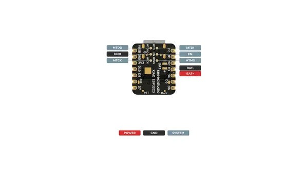
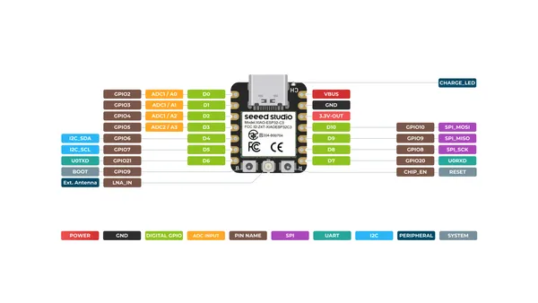
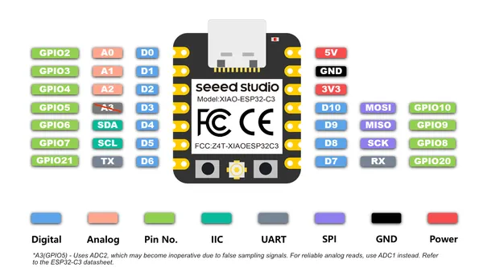
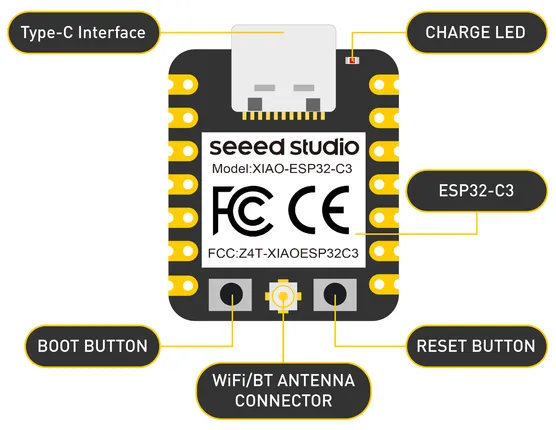
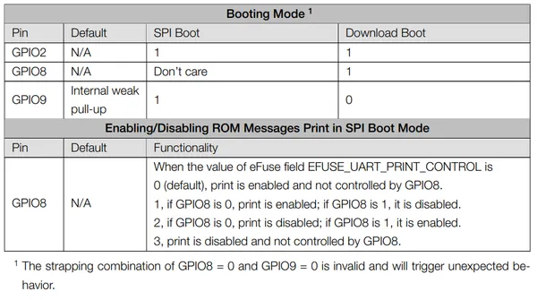

# XIAO ESP32C3

**Seeed Studio** · ESP32-C3

Revision: Not identified  
Coverage: Pinout image collected

[Browse all manufacturers](../../../../BROWSE.md) · [Desktop app](https://github.com/valleytechsolutions/black-wire-desktop)

## Pinout (Back)

**pinout image** · Reviewed source · PNG

[Open original reference](../../../../library/media/1bebe1addc32740a15decef63a8077fcf9c3963e586d8652f38bcaa0498812eb.png)

**Credit and rights:** Not established; source attribution retained. Source/manufacturer: Seeed Studio.

[Source 1](https://files.seeedstudio.com/wiki/XIAO_WiFi/XIAO_ESP32-C3_back_pinout.png) · [Source 2](https://wiki.seeedstudio.com/XIAO_ESP32C3_Getting_Started/)

SHA-256: `1bebe1addc32740a15decef63a8077fcf9c3963e586d8652f38bcaa0498812eb`

## Pinout (Front)

**pinout image** · Reviewed source · PNG

[Open original reference](../../../../library/media/ec46cb20e10331e7f2c84cba6f1b5e6470c6de96a47387b3cfbf9f659338612c.png)

**Credit and rights:** Not established; source attribution retained. Source/manufacturer: Seeed Studio.

[Source 1](https://files.seeedstudio.com/wiki/XIAO_WiFi/XIAO_ESP32-C3_front_pinout.png) · [Source 2](https://wiki.seeedstudio.com/XIAO_ESP32C3_Getting_Started/)

SHA-256: `ec46cb20e10331e7f2c84cba6f1b5e6470c6de96a47387b3cfbf9f659338612c`

## Pinout (Simplified)

**pinout image** · Reviewed source · PNG

[Open original reference](../../../../library/media/362839ac790983c42d50c93d2ec0d62c0d7e2c6273d3bf2244ed74873f1c714d.png)

**Credit and rights:** Not established; source attribution retained. Source/manufacturer: Seeed Studio.

[Source 1](https://files.seeedstudio.com/wiki/esp32c3_circuitpython/6.png) · [Source 2](https://wiki.seeedstudio.com/xiao_esp32c3_with_circuitpython/)

SHA-256: `362839ac790983c42d50c93d2ec0d62c0d7e2c6273d3bf2244ed74873f1c714d`

## Hardware Overview

**source reference** · Unreviewed source · PNG

[Open original reference](../../../../library/media/f144feac2769f2dae044d7184128295d6a6a5c5932ed6e7c0ee877f212a2480c.png)

**Credit and rights:** Source rights not yet established. Source/manufacturer: Seeed Studio.

[Source 1](https://files.seeedstudio.com/wiki/microblocks/xiao-esp32c3-overview.png) · [Source 2](https://wiki.seeedstudio.com/xiao_esp32c3_microblocks/)

Original source index: Hardware Overview. This file is searchable but has not been promoted to a reviewed physical board pinout.

SHA-256: `f144feac2769f2dae044d7184128295d6a6a5c5932ed6e7c0ee877f212a2480c`

## Pin Definition Table

**source reference** · Unreviewed source · PNG

[Open original reference](../../../../library/media/3fdca5c61af5927b15a01b3e21ea83e4fea201a372c9390f54136620d12769c0.png)

**Credit and rights:** Source rights not yet established. Source/manufacturer: Seeed Studio.

[Source 1](https://files.seeedstudio.com/wiki/XIAO_WiFi/20.png) · [Source 2](https://wiki.seeedstudio.com/XIAO_ESP32C3_Getting_Started/)

Original source index: Pin Definition Table. This file is searchable but has not been promoted to a reviewed physical board pinout.

SHA-256: `3fdca5c61af5927b15a01b3e21ea83e4fea201a372c9390f54136620d12769c0`

## Pinout Sheet

**source reference** · Unreviewed source · XLSX

[Open original reference](../../../../library/media/94b77c5438191904f8aaf43958a1484434e660060d4e403fe274422386761980.xlsx)

**Credit and rights:** Source rights not yet established. Source/manufacturer: Seeed Studio.

[Source 1](https://files.seeedstudio.com/wiki/XIAO_WiFi/Resources/XIAO-ESP32C3-pinout_sheet.xlsx) · [Source 2](https://wiki.seeedstudio.com/XIAO_ESP32C3_Getting_Started/)

Original source index: Pinout Sheet. This file is searchable but has not been promoted to a reviewed physical board pinout.

SHA-256: `94b77c5438191904f8aaf43958a1484434e660060d4e403fe274422386761980`

Pin assignments have not been independently electrically verified. Check board revision before wiring.
