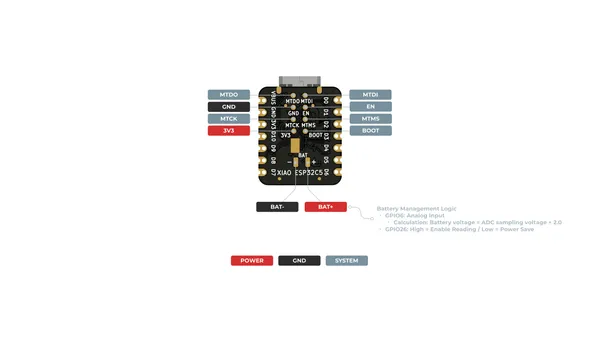
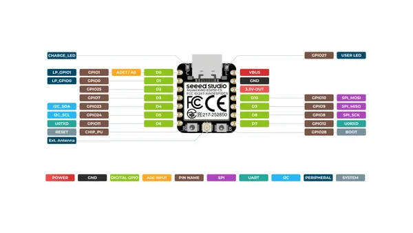

# XIAO ESP32C5

**Seeed Studio** · ESP32-C5

Revision: Not identified  
Coverage: Pinout image collected

[Browse all manufacturers](../../../../BROWSE.md) · [Desktop app](https://github.com/valleytechsolutions/black-wire-desktop)

## Pinout (Back)

**pinout image** · Reviewed source · PNG

[Open original reference](../../../../library/media/5cab8352de35a89559f677ebedef10bf4bed85f4cb926efedcb17c5191de4d4d.png)

**Credit and rights:** Not established; source attribution retained. Source/manufacturer: Seeed Studio.

[Source 1](https://files.seeedstudio.com/wiki/XIAO_ESP32C5/Getting_started/XIAO_ESP32-C5_back_pinout.png) · [Source 2](https://wiki.seeedstudio.com/xiao_esp32c5_getting_started/)

SHA-256: `5cab8352de35a89559f677ebedef10bf4bed85f4cb926efedcb17c5191de4d4d`

## Pinout (Front)

**pinout image** · Reviewed source · PNG

[Open original reference](../../../../library/media/b5441a1284e9fdf631616fcf9f7713777e7d0b0ae12de43d67849b8d8f391b23.png)

**Credit and rights:** Not established; source attribution retained. Source/manufacturer: Seeed Studio.

[Source 1](https://files.seeedstudio.com/wiki/XIAO_ESP32C5/Getting_started/XIAO_ESP32-C5_front_pinout.png) · [Source 2](https://wiki.seeedstudio.com/xiao_esp32c5_getting_started/)

SHA-256: `b5441a1284e9fdf631616fcf9f7713777e7d0b0ae12de43d67849b8d8f391b23`

## Pinout Sheet

**source reference** · Unreviewed source · XLSX

[Open original reference](../../../../library/media/3f1e0cbefc70dea85fb274074597a9bd2bc40aca6fc4e7ddcd79fc7ec2e04354.xlsx)

**Credit and rights:** Source rights not yet established. Source/manufacturer: Seeed Studio.

[Source 1](https://files.seeedstudio.com/wiki/XIAO_ESP32C5/res/XIAO_ESP32C5_Pinout.xlsx) · [Source 2](https://wiki.seeedstudio.com/xiao_esp32c5_getting_started/)

Original source index: Pinout Sheet. This file is searchable but has not been promoted to a reviewed physical board pinout.

SHA-256: `3f1e0cbefc70dea85fb274074597a9bd2bc40aca6fc4e7ddcd79fc7ec2e04354`

Pin assignments have not been independently electrically verified. Check board revision before wiring.
