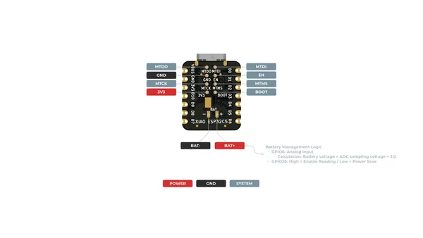
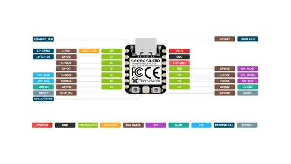
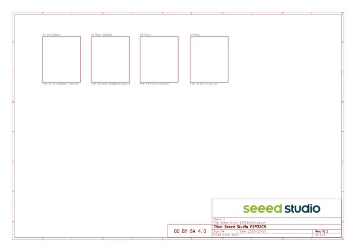

# XIAO ESP32C5

**Seeed Studio** · ESP32-C5

Revision: Not identified

Coverage: Manufacturer references reviewed by scope; independent electrical and all-connector review pending

[Browse all manufacturers](../../../../BROWSE.md) · [Devices & IoT](../../../../DEVICES.md) · [Open in the browser guide](https://valleytech-black-wire-guide.pages.dev/?board=seeed-studio-esp32-xiao-esp32c5)

## Datasheets and original documentation

Board datasheet: **not yet recorded**. Visual reference: **available**.

[Manufacturer hardware documentation](https://wiki.seeedstudio.com/xiao_esp32c5_getting_started/)

- **schematic / recorded-source**: [XIAO ESP32-C5 Schematic](https://files.seeedstudio.com/wiki/XIAO_ESP32C5/res/Seeed_Studio_XIAO_ESP32C5.pdf) · [saved document](../../../../library/media/d1e69e911d006a315a462e13347b2f7a821c067a003e8ee7fb522eff5f6bb01b.pdf)
- **hardware-guide / board**: [Manufacturer pin and hardware documentation](https://wiki.seeedstudio.com/xiao_esp32c5_getting_started/) · online

A chip datasheet, schematic and board datasheet have different scopes. Match the exact hardware revision.

[Documentation coverage and remaining gaps](../../../../DOCUMENTATION.md)

## Pinout (Back)

**pinout image** · Reviewed source · PNG

[Open original reference](../../../../library/media/5cab8352de35a89559f677ebedef10bf4bed85f4cb926efedcb17c5191de4d4d.png)

**Credit and rights:** Not established; source attribution retained. Source/manufacturer: Seeed Studio.

[Source 1](https://files.seeedstudio.com/wiki/XIAO_ESP32C5/Getting_started/XIAO_ESP32-C5_back_pinout.png) · [Source 2](https://wiki.seeedstudio.com/xiao_esp32c5_getting_started/)

Image revision: Not identified

SHA-256: `5cab8352de35a89559f677ebedef10bf4bed85f4cb926efedcb17c5191de4d4d`

## Pinout (Front)

**pinout image** · Reviewed source · PNG

[Open original reference](../../../../library/media/b5441a1284e9fdf631616fcf9f7713777e7d0b0ae12de43d67849b8d8f391b23.png)

**Credit and rights:** Not established; source attribution retained. Source/manufacturer: Seeed Studio.

[Source 1](https://files.seeedstudio.com/wiki/XIAO_ESP32C5/Getting_started/XIAO_ESP32-C5_front_pinout.png) · [Source 2](https://wiki.seeedstudio.com/xiao_esp32c5_getting_started/)

Image revision: Not identified

SHA-256: `b5441a1284e9fdf631616fcf9f7713777e7d0b0ae12de43d67849b8d8f391b23`

## Pinout Sheet

**source reference** · Unreviewed source · XLSX

[Open original reference](../../../../library/media/3f1e0cbefc70dea85fb274074597a9bd2bc40aca6fc4e7ddcd79fc7ec2e04354.xlsx)

**Credit and rights:** Source rights not yet established. Source/manufacturer: Seeed Studio.

[Source 1](https://files.seeedstudio.com/wiki/XIAO_ESP32C5/res/XIAO_ESP32C5_Pinout.xlsx) · [Source 2](https://wiki.seeedstudio.com/xiao_esp32c5_getting_started/)

Original source index: Pinout Sheet. This file is searchable but has not been promoted to a reviewed physical board pinout.

Image revision: Not identified

SHA-256: `3f1e0cbefc70dea85fb274074597a9bd2bc40aca6fc4e7ddcd79fc7ec2e04354`

## XIAO ESP32-C5 Schematic

**original reference PDF** · Source identity and visual scope inspected; PDF review covers first-page preview. Independent electrical and all-connector completeness review pending. · PDF

[Open original reference](../../../../library/media/d1e69e911d006a315a462e13347b2f7a821c067a003e8ee7fb522eff5f6bb01b.pdf)

**Credit and rights:** Manufacturer artwork; reuse and print rights not established. Inclusion does not relicense the original.. Source/manufacturer: Seeed Studio.

[Source 1](https://files.seeedstudio.com/wiki/XIAO_ESP32C5/res/Seeed_Studio_XIAO_ESP32C5.pdf) · [Source 2](https://wiki.seeedstudio.com/xiao_esp32c5_getting_started/)

Manufacturer source retained unchanged. Source identity and visual scope inspected; PDF review covers first-page preview. Independent electrical and all-connector completeness review pending.

Image revision: As supplied in the original; match exact board revision

SHA-256: `d1e69e911d006a315a462e13347b2f7a821c067a003e8ee7fb522eff5f6bb01b`

Pin assignments have not been independently electrically verified. Check board revision before wiring.
