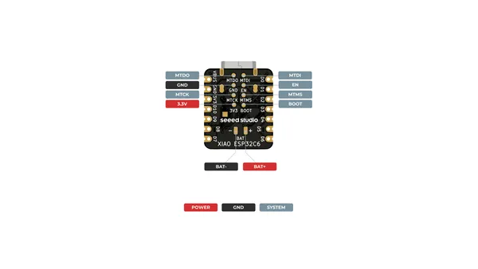
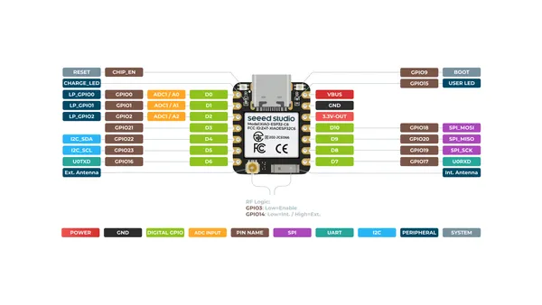
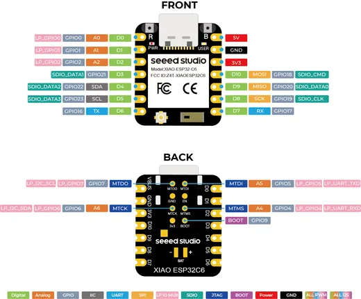

# XIAO ESP32C6

**Seeed Studio** · ESP32-C6

Revision: Not identified  
Coverage: Pinout image collected

[Browse all manufacturers](../../../../BROWSE.md) · [Desktop app](https://github.com/valleytechsolutions/black-wire-desktop)

## Pinout (Back)

**pinout image** · Reviewed source · PNG

[Open original reference](../../../../library/media/15b3042d4a9fee23bc47a762607a95cc5f6386115896c8cf452a0a48533c15f1.png)

**Credit and rights:** Not established; source attribution retained. Source/manufacturer: Seeed Studio.

[Source 1](https://files.seeedstudio.com/wiki/SeeedStudio-XIAO-ESP32C6/img/XIAO_ESP32-C6_back_pinout.png) · [Source 2](https://wiki.seeedstudio.com/xiao_esp32c6_getting_started/)

SHA-256: `15b3042d4a9fee23bc47a762607a95cc5f6386115896c8cf452a0a48533c15f1`

## Pinout (Front)

**pinout image** · Reviewed source · PNG

[Open original reference](../../../../library/media/1b91ef5a524472c379fcd251d20b6a9d71493a91cfc161ac032e9384499a045d.png)

**Credit and rights:** Not established; source attribution retained. Source/manufacturer: Seeed Studio.

[Source 1](https://files.seeedstudio.com/wiki/SeeedStudio-XIAO-ESP32C6/img/XIAO_ESP32-C6_front_pinout.png) · [Source 2](https://wiki.seeedstudio.com/xiao_esp32c6_getting_started/)

SHA-256: `1b91ef5a524472c379fcd251d20b6a9d71493a91cfc161ac032e9384499a045d`

## Pin Functions

**source reference** · Unreviewed source · PNG

[Open original reference](../../../../library/media/ac9c7e427c8aa78ad27d4e21dafcac3b3f60de74c49c9efcb15fbfd4593ae19d.png)

**Credit and rights:** Source rights not yet established. Source/manufacturer: Seeed Studio.

[Source 1](https://files.seeedstudio.com/wiki/esp32c6_circuitpython/5.png) · [Source 2](https://wiki.seeedstudio.com/xiao_esp32c6_with_circuitpython/)

Original source index: Pin Functions. This file is searchable but has not been promoted to a reviewed physical board pinout.

SHA-256: `ac9c7e427c8aa78ad27d4e21dafcac3b3f60de74c49c9efcb15fbfd4593ae19d`

## Pinout Sheet

**source reference** · Unreviewed source · XLSX

[Open original reference](../../../../library/media/e2dae530c359e66ba704039f86cfea4bc316596fde367d992723509777746494.xlsx)

**Credit and rights:** Source rights not yet established. Source/manufacturer: Seeed Studio.

[Source 1](https://files.seeedstudio.com/wiki/SeeedStudio-XIAO-ESP32C6/res/XIAO_ESP32C6_Pinout.xlsx) · [Source 2](https://wiki.seeedstudio.com/xiao_esp32c6_getting_started/)

Original source index: Pinout Sheet. This file is searchable but has not been promoted to a reviewed physical board pinout.

SHA-256: `e2dae530c359e66ba704039f86cfea4bc316596fde367d992723509777746494`

Pin assignments have not been independently electrically verified. Check board revision before wiring.
