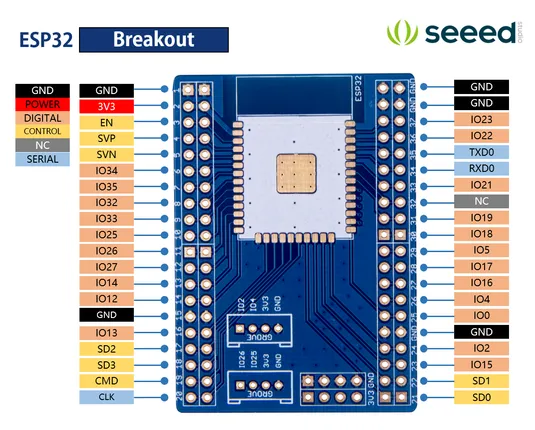

# ESP32 Breakout Kit

**Seeed Studio** · ESP32 original

Revision: Not identified  
Coverage: Pinout image collected

[Browse all manufacturers](../../../../BROWSE.md) · [Desktop app](https://github.com/valleytechsolutions/black-wire-desktop)

## Pinout

**pinout image** · Reviewed source · PNG

[Open original reference](../../../../library/media/cb4b7560a7030d560d7ad4cfee81260af9e6eb0f9cc1ba12727534cccf243ab9.png)

**Credit and rights:** Not established; source attribution retained. Source/manufacturer: Seeed Studio.

[Source 1](https://files.seeedstudio.com/wiki/ESP32_Breakout_Kit/img/esp32_breakout_pin.png) · [Source 2](https://wiki.seeedstudio.com/ESP32_Breakout_Kit/)

Imported from existing Seeed Studio Board Reference; original working path preserved.

SHA-256: `cb4b7560a7030d560d7ad4cfee81260af9e6eb0f9cc1ba12727534cccf243ab9`

Pin assignments have not been independently electrically verified. Check board revision before wiring.
