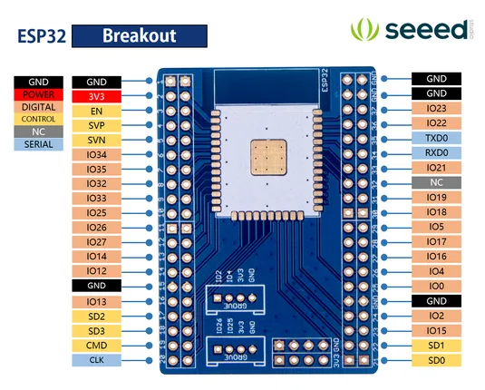

# ESP32 Breakout Kit

**Seeed Studio** · ESP32 original

Revision: Not identified

Coverage: Pinout image collected

[Browse all manufacturers](../../../../BROWSE.md) · [Devices & IoT](../../../../DEVICES.md) · [Open in the browser guide](https://valleytech-black-wire-guide.pages.dev/?board=seeed-studio-esp32-esp32-breakout-kit)

## Datasheets and original documentation

Board datasheet: **not yet recorded**. Visual reference: **available**.

[Manufacturer source (recorded link)](https://wiki.seeedstudio.com/ESP32_Breakout_Kit/)

A chip datasheet, schematic and board datasheet have different scopes. Match the exact hardware revision.

[Documentation coverage and remaining gaps](../../../../DOCUMENTATION.md)

## Pinout

**pinout image** · Reviewed source · PNG

[Open original reference](../../../../library/media/cb4b7560a7030d560d7ad4cfee81260af9e6eb0f9cc1ba12727534cccf243ab9.png)

**Credit and rights:** Not established; source attribution retained. Source/manufacturer: Seeed Studio.

[Source 1](https://files.seeedstudio.com/wiki/ESP32_Breakout_Kit/img/esp32_breakout_pin.png) · [Source 2](https://wiki.seeedstudio.com/ESP32_Breakout_Kit/)

Imported from existing Seeed Studio Board Reference; original working path preserved.

Image revision: Not identified

SHA-256: `cb4b7560a7030d560d7ad4cfee81260af9e6eb0f9cc1ba12727534cccf243ab9`

Pin assignments have not been independently electrically verified. Check board revision before wiring.
