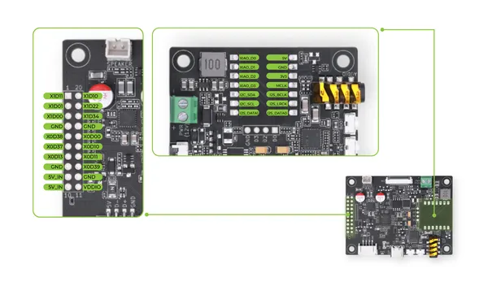
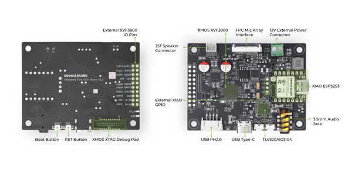

# reSpeaker Flex with XIAO ESP32S3

**Seeed Studio** · ESP32-S3

Revision: Not identified  
Coverage: Pinout image collected

[Browse all manufacturers](../../../../BROWSE.md) · [Desktop app](https://github.com/valleytechsolutions/black-wire-desktop)

## Pinout

**pinout image** · Reviewed source · JPG

[Open original reference](../../../../library/media/bae72902c31d0d458742805a9cc48e3e31cefa8e4851dfc3b3e78edc2cac73a2.jpg)

**Credit and rights:** Not established; source attribution retained. Source/manufacturer: Seeed Studio.

[Source 1](https://files.seeedstudio.com/wiki/reSpeaker_flex/header_pinout.jpg) · [Source 2](https://wiki.seeedstudio.com/respeaker_flex_introduction/)

Imported from existing Seeed Studio Board Reference; original working path preserved.

SHA-256: `bae72902c31d0d458742805a9cc48e3e31cefa8e4851dfc3b3e78edc2cac73a2`

## Hardware Overview 3

**source reference** · Unreviewed source · JPG

[Open original reference](../../../../library/media/8ffa2f38bfe142bb4d0bfbff361804654d9db38acba1a50c4b9b1d34ac8edc23.jpg)

**Credit and rights:** Source rights not yet established. Source/manufacturer: Seeed Studio.

[Source 1](https://files.seeedstudio.com/wiki/reSpeaker_flex/main.jpg) · [Source 2](https://wiki.seeedstudio.com/respeaker_flex_xiao_introduction/)

Original source index: Hardware Overview 3. This file is searchable but has not been promoted to a reviewed physical board pinout.

SHA-256: `8ffa2f38bfe142bb4d0bfbff361804654d9db38acba1a50c4b9b1d34ac8edc23`

Pin assignments have not been independently electrically verified. Check board revision before wiring.
