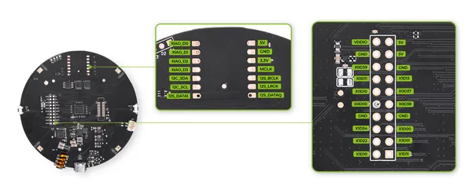
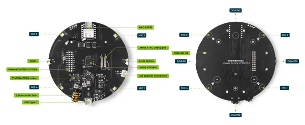

# reSpeaker XVF3800 USB 4-Mic Array with XIAO ESP32S3

**Seeed Studio** · ESP32-S3

Revision: Not identified  
Coverage: Pinout image collected

[Browse all manufacturers](../../../../BROWSE.md) · [Devices & IoT](../../../../DEVICES.md) · [Open in the browser guide](https://valleytech-black-wire-guide.pages.dev/?board=seeed-studio-gpio-device-respeaker-xvf3800-usb-4-mic-array-with-xiao-esp32s3)

Device category: **Cameras & audio**

## Pinout

**pinout image** · Reviewed source · JPG

[Open original reference](../../../../library/media/4fc0169086ad6cb9715473df13d84986f65f0d931166109c23609a32f1c51f75.jpg)

**Credit and rights:** Not established; source attribution retained. Source/manufacturer: Seeed Studio.

[Source 1](https://files.seeedstudio.com/wiki/respeaker_xvf3800_usb/pinout.jpg) · [Source 2](https://wiki.seeedstudio.com/respeaker_xvf3800_introduction/)

Imported from existing Seeed Studio Board Reference; original working path preserved.

Image revision: Not identified

SHA-256: `4fc0169086ad6cb9715473df13d84986f65f0d931166109c23609a32f1c51f75`

## Hardware Overview

**source reference** · Unreviewed source · JPG

[Open original reference](../../../../library/media/5f41f28f29a32979bd34e6257acf8770a283f71e88352103bf815534873140c1.jpg)

**Credit and rights:** Source rights not yet established. Source/manufacturer: Seeed Studio.

[Source 1](https://files.seeedstudio.com/wiki/respeaker_xvf3800_usb/xiao-xvf.jpg) · [Source 2](https://wiki.seeedstudio.com/respeaker_xvf3800_xiao_getting_started/)

Original source index: Hardware Overview. This file is searchable but has not been promoted to a reviewed physical board pinout.

Image revision: Not identified

SHA-256: `5f41f28f29a32979bd34e6257acf8770a283f71e88352103bf815534873140c1`

Pin assignments have not been independently electrically verified. Check board revision before wiring.
