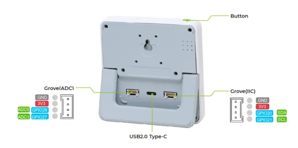
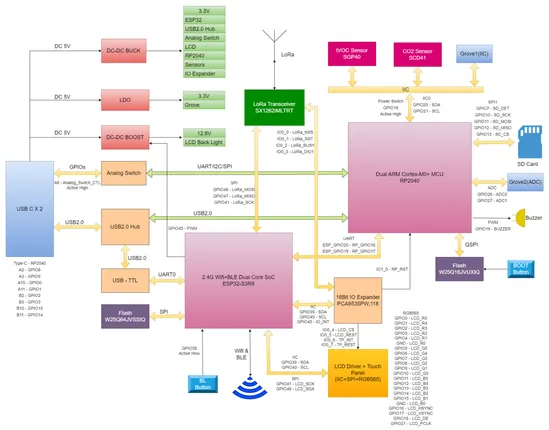
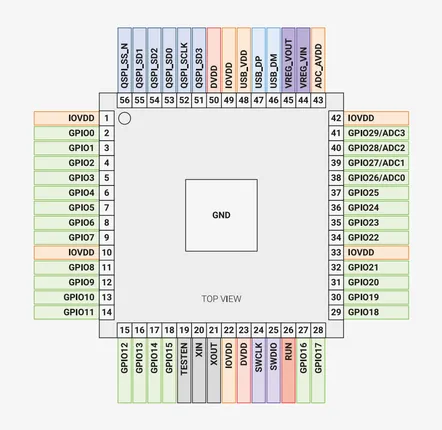

# SenseCAP Indicator

**Seeed Studio** · ESP32-S3

Revision: Not identified  
Coverage: Pinout image collected

[Browse all manufacturers](../../../../BROWSE.md) · [Devices & IoT](../../../../DEVICES.md) · [Open in the browser guide](https://valleytech-black-wire-guide.pages.dev/?board=seeed-studio-gpio-device-sensecap-indicator)

Device category: **Displays & HMI**

## Pinout (Back)

**pinout image** · Reviewed source · PNG

[Open original reference](../../../../library/media/7324a3885d2f950aaed6953f5218b8d6335b5cb67d28f8052beba9b449297590.png)

**Credit and rights:** Not established; source attribution retained. Source/manufacturer: Seeed Studio.

[Source 1](https://files.seeedstudio.com/wiki/SenseCAP/SenseCAP_Indicator/grove.png) · [Source 2](https://wiki.seeedstudio.com/SenseCAP_Indicator_RP2040_Grove_IIC/)

Imported from existing Seeed Studio Board Reference; original working path preserved.

Image revision: Not identified

SHA-256: `7324a3885d2f950aaed6953f5218b8d6335b5cb67d28f8052beba9b449297590`

## Block Diagram

**source reference** · Unreviewed source · PNG

[Open original reference](../../../../library/media/657a2c2accd600b3aab8f308da4b4267a90d148af92c1a71a734a5497938a0a5.png)

**Credit and rights:** Source rights not yet established. Source/manufacturer: Seeed Studio.

[Source 1](https://files.seeedstudio.com/wiki/SenseCAP/SenseCAP_Indicator/SenseCAP_Indicator_6.png) · [Source 2](https://wiki.seeedstudio.com/Sensor/SenseCAP/SenseCAP_Indicator/Get_started_with_SenseCAP_Indicator/)

Original source index: Block Diagram. This file is searchable but has not been promoted to a reviewed physical board pinout.

Image revision: Not identified

SHA-256: `657a2c2accd600b3aab8f308da4b4267a90d148af92c1a71a734a5497938a0a5`

## Pin Definition (RP2040)

**source reference** · Unreviewed source · PNG

[Open original reference](../../../../library/media/9e8d4b6000ad5306808970b56ee68223384c5411a5a29f97c317831a918cb0ef.png)

**Credit and rights:** Source rights not yet established. Source/manufacturer: Seeed Studio.

[Source 1](https://files.seeedstudio.com/wiki/SenseCAP/SenseCAP_Indicator/rppinout.png) · [Source 2](https://wiki.seeedstudio.com/SenseCAP_Indicator_Dive_into_the_Hardware/)

Original source index: Pin Definition (RP2040). This file is searchable but has not been promoted to a reviewed physical board pinout.

Image revision: Not identified

SHA-256: `9e8d4b6000ad5306808970b56ee68223384c5411a5a29f97c317831a918cb0ef`

Pin assignments have not been independently electrically verified. Check board revision before wiring.
