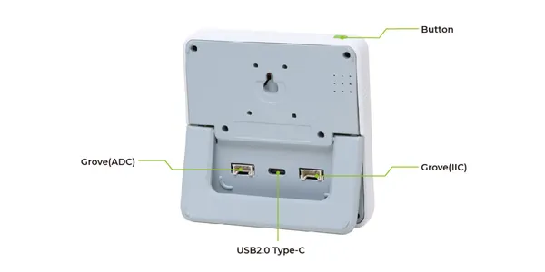
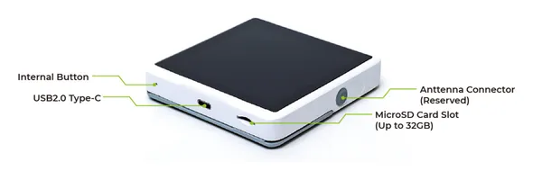

# SenseCAP Indicator D1

**Seeed Studio** · ESP32-S3

Revision: Not identified  
Coverage: Partial pinout collected; full reference still needed

[Browse all manufacturers](../../../../BROWSE.md) · [Devices & IoT](../../../../DEVICES.md) · [Open in the browser guide](https://valleytech-black-wire-guide.pages.dev/?board=seeed-studio-gpio-device-sensecap-indicator-d1)

Device category: **Displays & HMI**

## Pinout (USB-C Connector)

**pinout image** · Reviewed source · PNG

[Open original reference](../../../../library/media/2e322c248b80e125432e4071351e28fdb310486a227b50e3562b3bd46c46fe72.png)

**Credit and rights:** Not established; source attribution retained. Source/manufacturer: Seeed Studio.

[Source 1](https://files.seeedstudio.com/wiki/SenseCAP/SenseCAP_Indicator/SenseCAP_Indicator_7.png) · [Source 2](https://wiki.seeedstudio.com/Sensor/SenseCAP/SenseCAP_Indicator/Get_started_with_SenseCAP_Indicator/)

Imported from existing Seeed Studio Board Reference; original working path preserved. Only the named connector or subsection is covered.

Image revision: Not identified

SHA-256: `2e322c248b80e125432e4071351e28fdb310486a227b50e3562b3bd46c46fe72`

## Hardware Overview (Back)

**source reference** · Unreviewed source · PNG

[Open original reference](../../../../library/media/4dd95df8cb40b0ca177e7a8beb7e6e194ae6c35bb38b3d1e2d030b714b6468ee.png)

**Credit and rights:** Source rights not yet established. Source/manufacturer: Seeed Studio.

[Source 1](https://files.seeedstudio.com/wiki/SenseCAP/SenseCAP_Indicator/SenseCAP_Indicator_2.png) · [Source 2](https://wiki.seeedstudio.com/Sensor/SenseCAP/SenseCAP_Indicator/Get_started_with_SenseCAP_Indicator/)

Original source index: Hardware Overview (Back). This file is searchable but has not been promoted to a reviewed physical board pinout.

Image revision: Not identified

SHA-256: `4dd95df8cb40b0ca177e7a8beb7e6e194ae6c35bb38b3d1e2d030b714b6468ee`

## Hardware Overview (Side)

**source reference** · Unreviewed source · PNG

[Open original reference](../../../../library/media/267047e43f25d68f01fcf8c76bce95afa6fd7e84916e2e62c0ea244cd8908072.png)

**Credit and rights:** Source rights not yet established. Source/manufacturer: Seeed Studio.

[Source 1](https://files.seeedstudio.com/wiki/SenseCAP/SenseCAP_Indicator/SenseCAP_Indicator_3.png) · [Source 2](https://wiki.seeedstudio.com/Sensor/SenseCAP/SenseCAP_Indicator/Get_started_with_SenseCAP_Indicator/)

Original source index: Hardware Overview (Side). This file is searchable but has not been promoted to a reviewed physical board pinout.

Image revision: Not identified

SHA-256: `267047e43f25d68f01fcf8c76bce95afa6fd7e84916e2e62c0ea244cd8908072`

Pin assignments have not been independently electrically verified. Check board revision before wiring.
