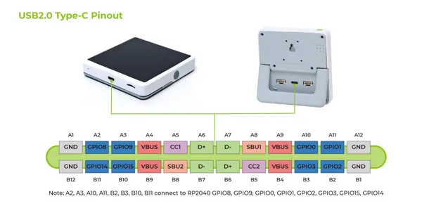

# SenseCAP Indicator D1L

**Seeed Studio** · ESP32-S3

Revision: Not identified  
Coverage: Partial pinout collected; full reference still needed

[Browse all manufacturers](../../../../BROWSE.md) · [Devices & IoT](../../../../DEVICES.md) · [Open in the browser guide](https://valleytech-black-wire-guide.pages.dev/?board=seeed-studio-gpio-device-sensecap-indicator-d1l)

Device category: **Displays & HMI**

## Pinout (USB-C Connector)

**pinout image** · Reviewed source · PNG

[Open original reference](../../../../library/media/2e322c248b80e125432e4071351e28fdb310486a227b50e3562b3bd46c46fe72.png)

**Credit and rights:** Not established; source attribution retained. Source/manufacturer: Seeed Studio.

[Source 1](https://files.seeedstudio.com/wiki/SenseCAP/SenseCAP_Indicator/SenseCAP_Indicator_7.png) · [Source 2](https://wiki.seeedstudio.com/Sensor/SenseCAP/SenseCAP_Indicator/Get_started_with_SenseCAP_Indicator/)

Imported from existing Seeed Studio Board Reference; original working path preserved. Only the named connector or subsection is covered.

Image revision: Not identified

SHA-256: `2e322c248b80e125432e4071351e28fdb310486a227b50e3562b3bd46c46fe72`

Pin assignments have not been independently electrically verified. Check board revision before wiring.
