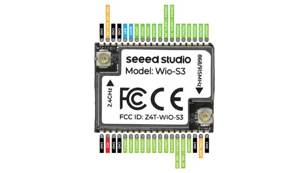
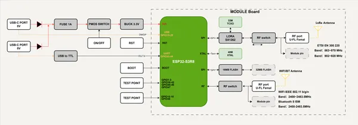
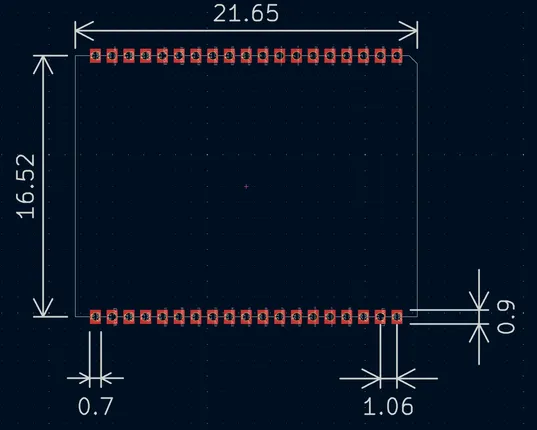
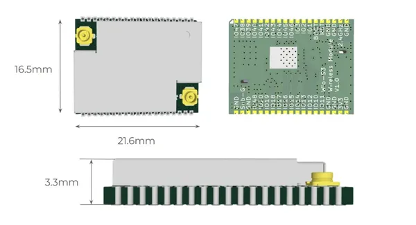
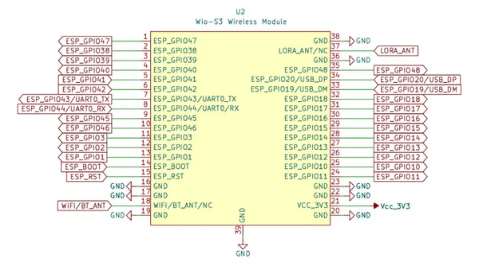

# Wio-S3 Wireless Module

**Seeed Studio** · ESP32-S3

Revision: Not identified  
Coverage: Pinout image collected

[Browse all manufacturers](../../../../BROWSE.md) · [Desktop app](https://github.com/valleytechsolutions/black-wire-desktop)

## Pinout

**pinout image** · Reviewed source · JPG

[Open original reference](../../../../library/media/6651a0f110a08b9876486ec97b0a1ca60564108ccb7ed3ce1685ee8a059c40c2.jpg)

**Credit and rights:** Not established; source attribution retained. Source/manufacturer: Seeed Studio.

[Source 1](https://files.seeedstudio.com/wiki/SenseCAP/Wio-S3/pinout-2.jpg) · [Source 2](https://wiki.seeedstudio.com/wio-s3_wireless_module_introduction/)

Imported from existing Seeed Studio Board Reference; original working path preserved.

SHA-256: `6651a0f110a08b9876486ec97b0a1ca60564108ccb7ed3ce1685ee8a059c40c2`

## Block Diagram

**source reference** · Unreviewed source · PNG

[Open original reference](../../../../library/media/9f98df5b7d8991cb2d10c987dd24a3115b16514d8b204fdbaea2b07def844b13.png)

**Credit and rights:** Source rights not yet established. Source/manufacturer: Seeed Studio.

[Source 1](https://files.seeedstudio.com/wiki/SenseCAP/Wio-S3/reference-design-of-s3.png) · [Source 2](https://wiki.seeedstudio.com/wio-s3_wireless_module_introduction/)

Original source index: Block Diagram. This file is searchable but has not been promoted to a reviewed physical board pinout.

SHA-256: `9f98df5b7d8991cb2d10c987dd24a3115b16514d8b204fdbaea2b07def844b13`

## Dimensions (PCB Footprint)

**source reference** · Unreviewed source · JPG

[Open original reference](../../../../library/media/53d786897bffa907ebeeb7aec1051ab801efc0f94039f8666332e24a1301b744.jpg)

**Credit and rights:** Source rights not yet established. Source/manufacturer: Seeed Studio.

[Source 1](https://files.seeedstudio.com/wiki/SenseCAP/Wio-S3/layout.jpg) · [Source 2](https://wiki.seeedstudio.com/wio-s3_wireless_module_introduction/)

Original source index: Dimensions (PCB Footprint). This file is searchable but has not been promoted to a reviewed physical board pinout.

SHA-256: `53d786897bffa907ebeeb7aec1051ab801efc0f94039f8666332e24a1301b744`

## Dimensions

**source reference** · Unreviewed source · JPG

[Open original reference](../../../../library/media/feabf0a1303c0000277de27e6f4729f5c85cdb490ab290d0d88c3ce731bf98ba.jpg)

**Credit and rights:** Source rights not yet established. Source/manufacturer: Seeed Studio.

[Source 1](https://files.seeedstudio.com/wiki/SenseCAP/Wio-S3/appearance.jpg) · [Source 2](https://wiki.seeedstudio.com/wio-s3_wireless_module_introduction/)

Original source index: Dimensions. This file is searchable but has not been promoted to a reviewed physical board pinout.

SHA-256: `feabf0a1303c0000277de27e6f4729f5c85cdb490ab290d0d88c3ce731bf98ba`

## Pinout (Schematic Symbol)

**source reference** · Unreviewed source · JPG

[Open original reference](../../../../library/media/67f617506cd693858a55fbc944286618bb9fc4e4a747403f9ba53afe696d5170.jpg)

**Credit and rights:** Source rights not yet established. Source/manufacturer: Seeed Studio.

[Source 1](https://files.seeedstudio.com/wiki/SenseCAP/Wio-S3/pinout.jpg) · [Source 2](https://wiki.seeedstudio.com/wio-s3_wireless_module_introduction/)

Original source index: Pinout (Schematic Symbol). This file is searchable but has not been promoted to a reviewed physical board pinout.

SHA-256: `67f617506cd693858a55fbc944286618bb9fc4e4a747403f9ba53afe696d5170`

Pin assignments have not been independently electrically verified. Check board revision before wiring.
