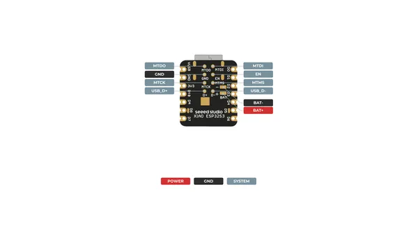
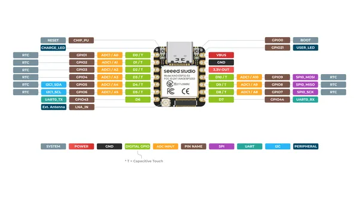
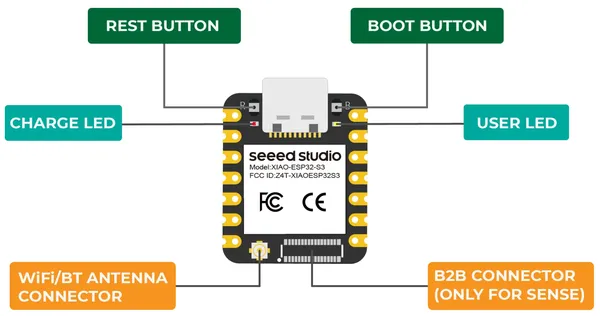
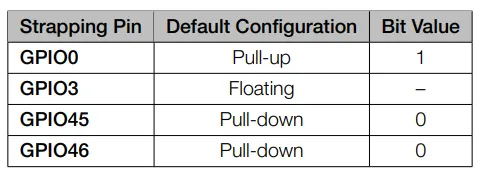
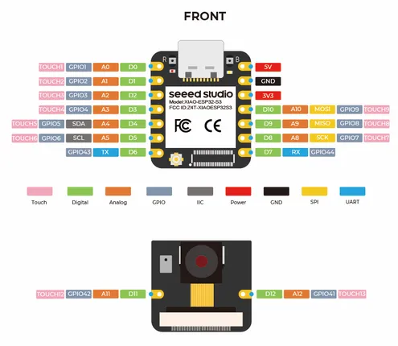
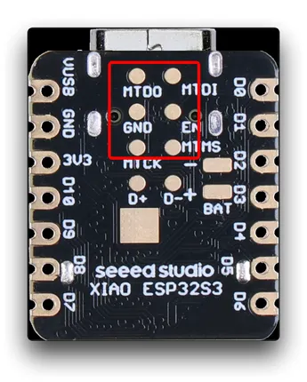
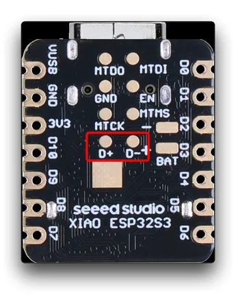

# XIAO ESP32S3

**Seeed Studio** · ESP32-S3

Revision: Not identified  
Coverage: Pinout image collected

[Browse all manufacturers](../../../../BROWSE.md) · [Desktop app](https://github.com/valleytechsolutions/black-wire-desktop)

## Pinout (Back)

**pinout image** · Reviewed source · PNG

[Open original reference](../../../../library/media/49dfbb6d873c52990b4985e0533ec04c811b3d180eb266bd476ca013e75b714d.png)

**Credit and rights:** Not established; source attribution retained. Source/manufacturer: Seeed Studio.

[Source 1](https://files.seeedstudio.com/wiki/SeeedStudio-XIAO-ESP32S3/img/XIAO_ESP32-S3_back_pinout.png) · [Source 2](https://wiki.seeedstudio.com/xiao_esp32s3_getting_started/)

SHA-256: `49dfbb6d873c52990b4985e0533ec04c811b3d180eb266bd476ca013e75b714d`

## Pinout (Front)

**pinout image** · Reviewed source · PNG

[Open original reference](../../../../library/media/27a54de4cd855aa5269fbfbc9c49715fcedf104dbf1b7cef7e9a4833b206a8e2.png)

**Credit and rights:** Not established; source attribution retained. Source/manufacturer: Seeed Studio.

[Source 1](https://files.seeedstudio.com/wiki/SeeedStudio-XIAO-ESP32S3/img/XIAO_ESP32-S3_front_pinout.png) · [Source 2](https://wiki.seeedstudio.com/xiao_esp32s3_getting_started/)

SHA-256: `27a54de4cd855aa5269fbfbc9c49715fcedf104dbf1b7cef7e9a4833b206a8e2`

## Hardware Overview

**source reference** · Unreviewed source · PNG

[Open original reference](../../../../library/media/2babfc99995f8b9f28e55a3ad37ca4555c0e75721810eb2c41fd0727f83211df.png)

**Credit and rights:** Source rights not yet established. Source/manufacturer: Seeed Studio.

[Source 1](https://files.seeedstudio.com/wiki/microblocks/xiao-esp32-s3-sense-overview.png) · [Source 2](https://wiki.seeedstudio.com/xiao_esp32s3_microblocks/)

Original source index: Hardware Overview. This file is searchable but has not been promoted to a reviewed physical board pinout.

SHA-256: `2babfc99995f8b9f28e55a3ad37ca4555c0e75721810eb2c41fd0727f83211df`

## Pin Definition Table (Strapping Pins)

**source reference** · Unreviewed source · PNG

[Open original reference](../../../../library/media/c255aac5c46d699767bd58e22124a77bea93992d912d010df46e3bbca579d6c9.png)

**Credit and rights:** Source rights not yet established. Source/manufacturer: Seeed Studio.

[Source 1](https://files.seeedstudio.com/wiki/SeeedStudio-XIAO-ESP32S3/img/110.png) · [Source 2](https://wiki.seeedstudio.com/xiao_esp32s3_getting_started/)

Original source index: Pin Definition Table (Strapping Pins). This file is searchable but has not been promoted to a reviewed physical board pinout.

SHA-256: `c255aac5c46d699767bd58e22124a77bea93992d912d010df46e3bbca579d6c9`

## Pin Functions

**source reference** · Unreviewed source · PNG

[Open original reference](../../../../library/media/20848775a443eb9d35b85badcaef095d604759055303633c6eea3c3a6e5f53cf.png)

**Credit and rights:** Source rights not yet established. Source/manufacturer: Seeed Studio.

[Source 1](https://files.seeedstudio.com/wiki/esp32s3_micropython/10.png) · [Source 2](https://wiki.seeedstudio.com/xiao_esp32s3_with_micropython/)

Original source index: Pin Functions. This file is searchable but has not been promoted to a reviewed physical board pinout.

SHA-256: `20848775a443eb9d35b85badcaef095d604759055303633c6eea3c3a6e5f53cf`

## Pin Multiplexing (JTAG)

**source reference** · Unreviewed source · PNG

[Open original reference](../../../../library/media/76bf6a72a926c5039c6b7b7ab9d20d0dbe556c51e728b8ef26c205100769a808.png)

**Credit and rights:** Source rights not yet established. Source/manufacturer: Seeed Studio.

[Source 1](https://files.seeedstudio.com/wiki/SeeedStudio-XIAO-ESP32S3/img/35.png) · [Source 2](https://wiki.seeedstudio.com/xiao_esp32s3_pin_multiplexing/)

Original source index: Pin Multiplexing (JTAG). This file is searchable but has not been promoted to a reviewed physical board pinout.

SHA-256: `76bf6a72a926c5039c6b7b7ab9d20d0dbe556c51e728b8ef26c205100769a808`

## Pin Multiplexing (USB)

**source reference** · Unreviewed source · PNG

[Open original reference](../../../../library/media/f9fa84da1db5afe0c55cd3093f421650dead814e8ad92c997accd09a1bb86024.png)

**Credit and rights:** Source rights not yet established. Source/manufacturer: Seeed Studio.

[Source 1](https://files.seeedstudio.com/wiki/SeeedStudio-XIAO-ESP32S3/img/36.png) · [Source 2](https://wiki.seeedstudio.com/xiao_esp32s3_pin_multiplexing/)

Original source index: Pin Multiplexing (USB). This file is searchable but has not been promoted to a reviewed physical board pinout.

SHA-256: `f9fa84da1db5afe0c55cd3093f421650dead814e8ad92c997accd09a1bb86024`

## Pinout Sheet

**source reference** · Unreviewed source · XLSX

[Open original reference](../../../../library/media/d31153ed6a9bb5c2e0ab1bd1ec5bd620620664c06ec4bb55cf74caf0a08b8365.xlsx)

**Credit and rights:** Source rights not yet established. Source/manufacturer: Seeed Studio.

[Source 1](https://files.seeedstudio.com/wiki/SeeedStudio-XIAO-ESP32S3/res/XIAO_ESP32S3_Sense_Pinout.xlsx) · [Source 2](https://wiki.seeedstudio.com/xiao_esp32s3_getting_started/)

Original source index: Pinout Sheet. This file is searchable but has not been promoted to a reviewed physical board pinout.

SHA-256: `d31153ed6a9bb5c2e0ab1bd1ec5bd620620664c06ec4bb55cf74caf0a08b8365`

Pin assignments have not been independently electrically verified. Check board revision before wiring.
