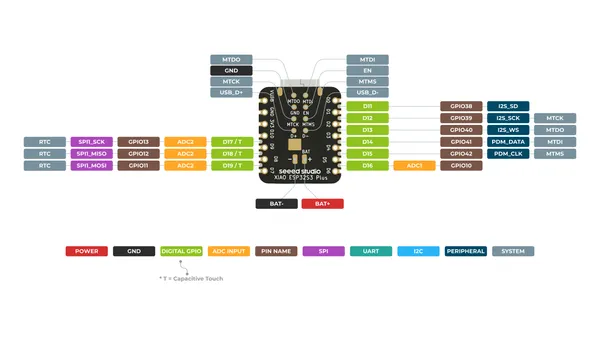
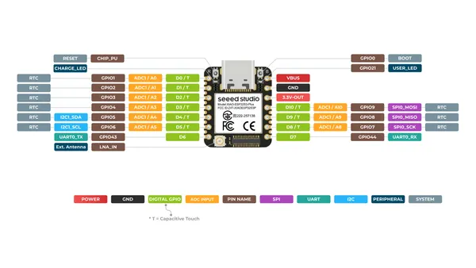

# XIAO ESP32S3 Plus

**Seeed Studio** · ESP32-S3

Revision: Not identified  
Coverage: Pinout image collected

[Browse all manufacturers](../../../../BROWSE.md) · [Desktop app](https://github.com/valleytechsolutions/black-wire-desktop)

## Pinout (Back)

**pinout image** · Reviewed source · PNG

[Open original reference](../../../../library/media/17207eb60a5049bfd7b4227475b6b03d8ca6b904e7e2f6e77ecd1569a00d48c7.png)

**Credit and rights:** Not established; source attribution retained. Source/manufacturer: Seeed Studio.

[Source 1](https://files.seeedstudio.com/wiki/SeeedStudio-XIAO-ESP32S3/img/XIAO_ESP32-S3_Plus_back_pinout.png) · [Source 2](https://wiki.seeedstudio.com/xiao_esp32s3_getting_started/)

SHA-256: `17207eb60a5049bfd7b4227475b6b03d8ca6b904e7e2f6e77ecd1569a00d48c7`

## Pinout (Front)

**pinout image** · Reviewed source · PNG

[Open original reference](../../../../library/media/a16289a228731548ccaf7fb31bdf79a12d4cbb69369cf882fc7443fe24dd3b33.png)

**Credit and rights:** Not established; source attribution retained. Source/manufacturer: Seeed Studio.

[Source 1](https://files.seeedstudio.com/wiki/SeeedStudio-XIAO-ESP32S3/img/XIAO_ESP32-S3_Plus_front_pinout.png) · [Source 2](https://wiki.seeedstudio.com/xiao_esp32s3_getting_started/)

SHA-256: `a16289a228731548ccaf7fb31bdf79a12d4cbb69369cf882fc7443fe24dd3b33`

## Pinout Sheet

**source reference** · Unreviewed source · XLSX

[Open original reference](../../../../library/media/5dd771ebbb3d0e075b1de7123a354c43e4ee0907b2e3dba0ca9b835b37223cd5.xlsx)

**Credit and rights:** Source rights not yet established. Source/manufacturer: Seeed Studio.

[Source 1](https://files.seeedstudio.com/wiki/SeeedStudio-XIAO-ESP32S3/res/Seeed_Studio_XIAO_ESP32S3_Plus_Pinout.xlsx) · [Source 2](https://wiki.seeedstudio.com/xiao_esp32s3_getting_started/)

Original source index: Pinout Sheet. This file is searchable but has not been promoted to a reviewed physical board pinout.

SHA-256: `5dd771ebbb3d0e075b1de7123a354c43e4ee0907b2e3dba0ca9b835b37223cd5`

Pin assignments have not been independently electrically verified. Check board revision before wiring.
