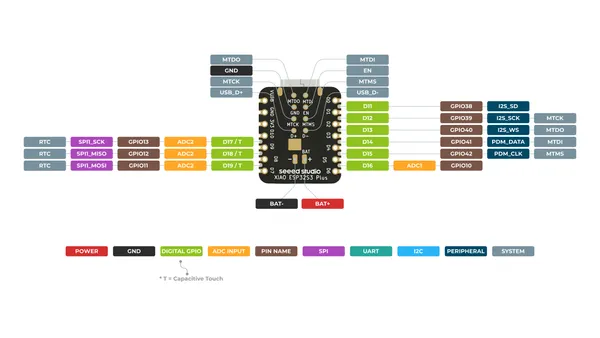
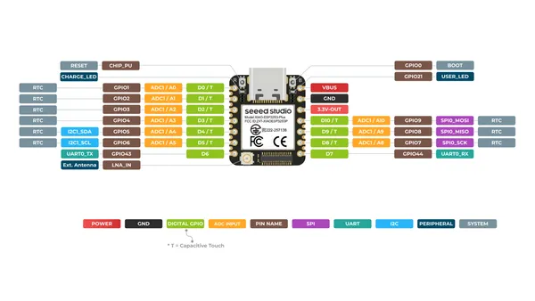
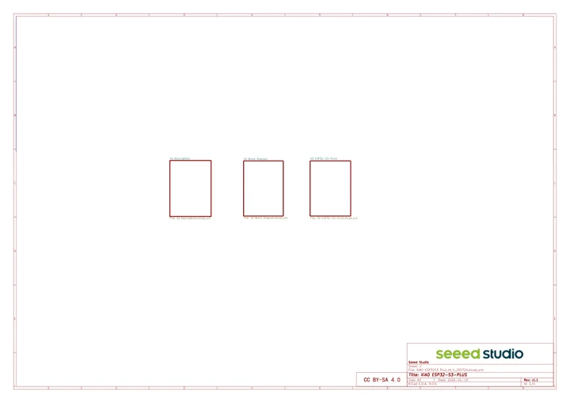

# XIAO ESP32S3 Plus

**Seeed Studio** · ESP32-S3

Revision: Not identified

Coverage: Manufacturer references reviewed by scope; independent electrical and all-connector review pending

[Browse all manufacturers](../../../../BROWSE.md) · [Devices & IoT](../../../../DEVICES.md) · [Open in the browser guide](https://valleytech-black-wire-guide.pages.dev/?board=seeed-studio-esp32-xiao-esp32s3-plus)

## Datasheets and original documentation

Board datasheet: **not yet recorded**. Visual reference: **available**.

[Manufacturer hardware documentation](https://wiki.seeedstudio.com/xiao_esp32s3_getting_started/)

- **schematic / recorded-source**: [XIAO ESP32-S3 Plus Schematic](https://files.seeedstudio.com/wiki/SeeedStudio-XIAO-ESP32S3/res/XIAO_ESP32S3_Plus_V1.1_SCH_260115.pdf) · [saved document](../../../../library/media/5d0213b6258b2658e5edae4d4ee166f6f852e1d0c304bddff5006f6ec6a7d9b9.pdf)
- **hardware-guide / board**: [Manufacturer pin and hardware documentation](https://wiki.seeedstudio.com/xiao_esp32s3_getting_started/) · online

A chip datasheet, schematic and board datasheet have different scopes. Match the exact hardware revision.

[Documentation coverage and remaining gaps](../../../../DOCUMENTATION.md)

## Pinout (Back)

**pinout image** · Reviewed source · PNG

[Open original reference](../../../../library/media/17207eb60a5049bfd7b4227475b6b03d8ca6b904e7e2f6e77ecd1569a00d48c7.png)

**Credit and rights:** Not established; source attribution retained. Source/manufacturer: Seeed Studio.

[Source 1](https://files.seeedstudio.com/wiki/SeeedStudio-XIAO-ESP32S3/img/XIAO_ESP32-S3_Plus_back_pinout.png) · [Source 2](https://wiki.seeedstudio.com/xiao_esp32s3_getting_started/)

Image revision: Not identified

SHA-256: `17207eb60a5049bfd7b4227475b6b03d8ca6b904e7e2f6e77ecd1569a00d48c7`

## Pinout (Front)

**pinout image** · Reviewed source · PNG

[Open original reference](../../../../library/media/a16289a228731548ccaf7fb31bdf79a12d4cbb69369cf882fc7443fe24dd3b33.png)

**Credit and rights:** Not established; source attribution retained. Source/manufacturer: Seeed Studio.

[Source 1](https://files.seeedstudio.com/wiki/SeeedStudio-XIAO-ESP32S3/img/XIAO_ESP32-S3_Plus_front_pinout.png) · [Source 2](https://wiki.seeedstudio.com/xiao_esp32s3_getting_started/)

Image revision: Not identified

SHA-256: `a16289a228731548ccaf7fb31bdf79a12d4cbb69369cf882fc7443fe24dd3b33`

## Pinout Sheet

**source reference** · Unreviewed source · XLSX

[Open original reference](../../../../library/media/5dd771ebbb3d0e075b1de7123a354c43e4ee0907b2e3dba0ca9b835b37223cd5.xlsx)

**Credit and rights:** Source rights not yet established. Source/manufacturer: Seeed Studio.

[Source 1](https://files.seeedstudio.com/wiki/SeeedStudio-XIAO-ESP32S3/res/Seeed_Studio_XIAO_ESP32S3_Plus_Pinout.xlsx) · [Source 2](https://wiki.seeedstudio.com/xiao_esp32s3_getting_started/)

Original source index: Pinout Sheet. This file is searchable but has not been promoted to a reviewed physical board pinout.

Image revision: Not identified

SHA-256: `5dd771ebbb3d0e075b1de7123a354c43e4ee0907b2e3dba0ca9b835b37223cd5`

## XIAO ESP32-S3 Plus Schematic

**original reference PDF** · Source identity and visual scope inspected; PDF review covers first-page preview. Independent electrical and all-connector completeness review pending. · PDF

[Open original reference](../../../../library/media/5d0213b6258b2658e5edae4d4ee166f6f852e1d0c304bddff5006f6ec6a7d9b9.pdf)

**Credit and rights:** Manufacturer artwork; reuse and print rights not established. Inclusion does not relicense the original.. Source/manufacturer: Seeed Studio.

[Source 1](https://files.seeedstudio.com/wiki/SeeedStudio-XIAO-ESP32S3/res/XIAO_ESP32S3_Plus_V1.1_SCH_260115.pdf) · [Source 2](https://wiki.seeedstudio.com/xiao_esp32s3_getting_started/)

Manufacturer source retained unchanged. Source identity and visual scope inspected; PDF review covers first-page preview. Independent electrical and all-connector completeness review pending.

Image revision: As supplied in the original; match exact board revision

SHA-256: `5d0213b6258b2658e5edae4d4ee166f6f852e1d0c304bddff5006f6ec6a7d9b9`

Pin assignments have not been independently electrically verified. Check board revision before wiring.
