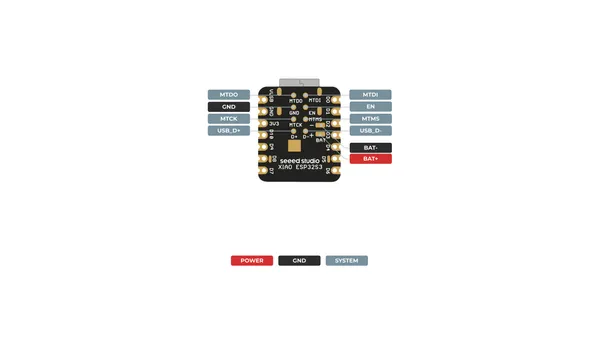
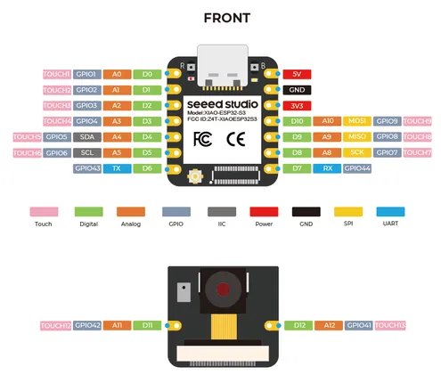
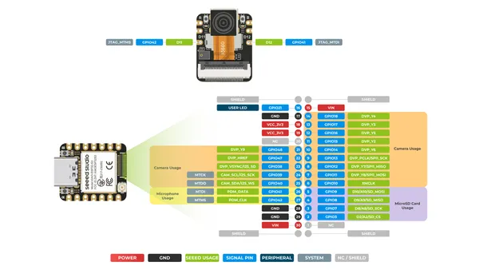

# XIAO ESP32S3 Sense

**Seeed Studio** · ESP32-S3

Revision: Not identified  
Coverage: Pinout image collected

[Browse all manufacturers](../../../../BROWSE.md) · [Desktop app](https://github.com/valleytechsolutions/black-wire-desktop)

## Pinout (Back)

**pinout image** · Reviewed source · PNG

[Open original reference](../../../../library/media/91b5266fd29b73c7218173430c035444960460f89c4ac582fe595e395053f02f.png)

**Credit and rights:** Not established; source attribution retained. Source/manufacturer: Seeed Studio.

[Source 1](https://files.seeedstudio.com/wiki/SeeedStudio-XIAO-ESP32S3/img/XIAO_ESP32-S3_Sense_back_pinout.png) · [Source 2](https://wiki.seeedstudio.com/xiao_esp32s3_getting_started/)

SHA-256: `91b5266fd29b73c7218173430c035444960460f89c4ac582fe595e395053f02f`

## Pinout (Front)

**pinout image** · Reviewed source · JPG

[Open original reference](../../../../library/media/1c244cdaa031b54d7cbaa0abcec30eaabf958b6c3784ee6ff3d0d89107e14409.jpg)

**Credit and rights:** Not established; source attribution retained. Source/manufacturer: Seeed Studio.

[Source 1](https://files.seeedstudio.com/wiki/SeeedStudio-XIAO-ESP32S3/img/2.jpg) · [Source 2](https://wiki.seeedstudio.com/xiao-esp32s3-freertos/)

SHA-256: `1c244cdaa031b54d7cbaa0abcec30eaabf958b6c3784ee6ff3d0d89107e14409`

## Pinout (Front)

**pinout image** · Reviewed source · PNG

[Open original reference](../../../../library/media/5fe775f131ab8e84a1860b5435c30edf1e77f7ab9bc4e08c2e428fc4bb4c00c8.png)

**Credit and rights:** Not established; source attribution retained. Source/manufacturer: Seeed Studio.

[Source 1](https://files.seeedstudio.com/wiki/SeeedStudio-XIAO-ESP32S3/img/XIAO_ESP32-S3_Sense_front_pinout.png) · [Source 2](https://wiki.seeedstudio.com/xiao_esp32s3_getting_started/)

SHA-256: `5fe775f131ab8e84a1860b5435c30edf1e77f7ab9bc4e08c2e428fc4bb4c00c8`

Pin assignments have not been independently electrically verified. Check board revision before wiring.
