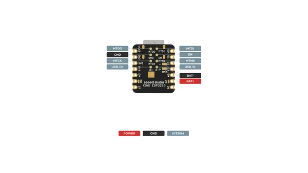
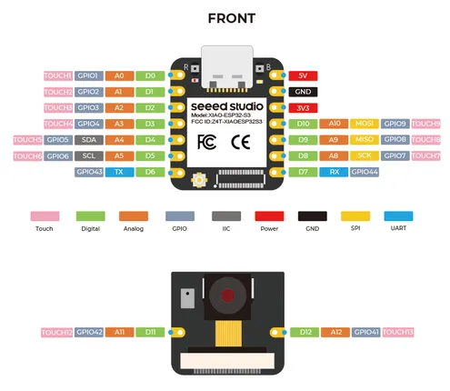
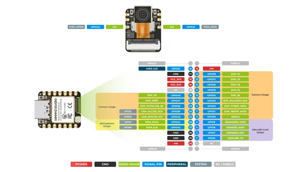
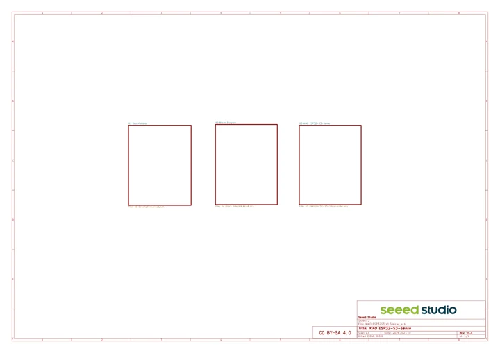

# XIAO ESP32S3 Sense

**Seeed Studio** · ESP32-S3

Revision: Not identified

Coverage: Manufacturer references reviewed by scope; independent electrical and all-connector review pending

[Browse all manufacturers](../../../../BROWSE.md) · [Devices & IoT](../../../../DEVICES.md) · [Open in the browser guide](https://valleytech-black-wire-guide.pages.dev/?board=seeed-studio-esp32-xiao-esp32s3-sense)

## Datasheets and original documentation

Board datasheet: **not yet recorded**. Visual reference: **available**.

[Manufacturer hardware documentation](https://wiki.seeedstudio.com/xiao_esp32s3_getting_started/)

- **schematic / recorded-source**: [XIAO ESP32-S3 Sense Schematic](https://files.seeedstudio.com/wiki/SeeedStudio-XIAO-ESP32S3/new-res/202003753_XIAO%20ESP32S3%20Sense_v1.5_SCH_260226.pdf.pdf) · [saved document](../../../../library/media/15993097cd695d177af352f4664ca91290a99c833f51d122d1165ef222f9923c.pdf)
- **hardware-guide / board**: [Manufacturer pin and hardware documentation](https://wiki.seeedstudio.com/xiao_esp32s3_getting_started/) · online

A chip datasheet, schematic and board datasheet have different scopes. Match the exact hardware revision.

[Documentation coverage and remaining gaps](../../../../DOCUMENTATION.md)

## Pinout (Back)

**pinout image** · Reviewed source · PNG

[Open original reference](../../../../library/media/91b5266fd29b73c7218173430c035444960460f89c4ac582fe595e395053f02f.png)

**Credit and rights:** Not established; source attribution retained. Source/manufacturer: Seeed Studio.

[Source 1](https://files.seeedstudio.com/wiki/SeeedStudio-XIAO-ESP32S3/img/XIAO_ESP32-S3_Sense_back_pinout.png) · [Source 2](https://wiki.seeedstudio.com/xiao_esp32s3_getting_started/)

Image revision: Not identified

SHA-256: `91b5266fd29b73c7218173430c035444960460f89c4ac582fe595e395053f02f`

## Pinout (Front)

**pinout image** · Reviewed source · JPG

[Open original reference](../../../../library/media/1c244cdaa031b54d7cbaa0abcec30eaabf958b6c3784ee6ff3d0d89107e14409.jpg)

**Credit and rights:** Not established; source attribution retained. Source/manufacturer: Seeed Studio.

[Source 1](https://files.seeedstudio.com/wiki/SeeedStudio-XIAO-ESP32S3/img/2.jpg) · [Source 2](https://wiki.seeedstudio.com/xiao-esp32s3-freertos/)

Image revision: Not identified

SHA-256: `1c244cdaa031b54d7cbaa0abcec30eaabf958b6c3784ee6ff3d0d89107e14409`

## Pinout (Front)

**pinout image** · Reviewed source · PNG

[Open original reference](../../../../library/media/5fe775f131ab8e84a1860b5435c30edf1e77f7ab9bc4e08c2e428fc4bb4c00c8.png)

**Credit and rights:** Not established; source attribution retained. Source/manufacturer: Seeed Studio.

[Source 1](https://files.seeedstudio.com/wiki/SeeedStudio-XIAO-ESP32S3/img/XIAO_ESP32-S3_Sense_front_pinout.png) · [Source 2](https://wiki.seeedstudio.com/xiao_esp32s3_getting_started/)

Image revision: Not identified

SHA-256: `5fe775f131ab8e84a1860b5435c30edf1e77f7ab9bc4e08c2e428fc4bb4c00c8`

## XIAO ESP32-S3 Sense Schematic

**original reference PDF** · Source identity and visual scope inspected; PDF review covers first-page preview. Independent electrical and all-connector completeness review pending. · PDF

[Open original reference](../../../../library/media/15993097cd695d177af352f4664ca91290a99c833f51d122d1165ef222f9923c.pdf)

**Credit and rights:** Manufacturer artwork; reuse and print rights not established. Inclusion does not relicense the original.. Source/manufacturer: Seeed Studio.

[Source 1](https://files.seeedstudio.com/wiki/SeeedStudio-XIAO-ESP32S3/new-res/202003753_XIAO%20ESP32S3%20Sense_v1.5_SCH_260226.pdf.pdf) · [Source 2](https://wiki.seeedstudio.com/xiao_esp32s3_getting_started/)

Manufacturer source retained unchanged. Source identity and visual scope inspected; PDF review covers first-page preview. Independent electrical and all-connector completeness review pending.

Image revision: As supplied in the original; match exact board revision

SHA-256: `15993097cd695d177af352f4664ca91290a99c833f51d122d1165ef222f9923c`

Pin assignments have not been independently electrically verified. Check board revision before wiring.
