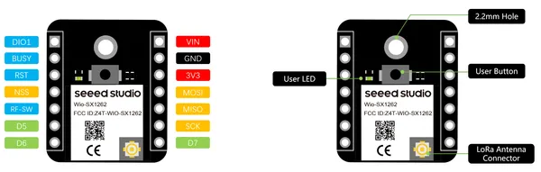
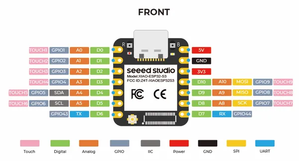
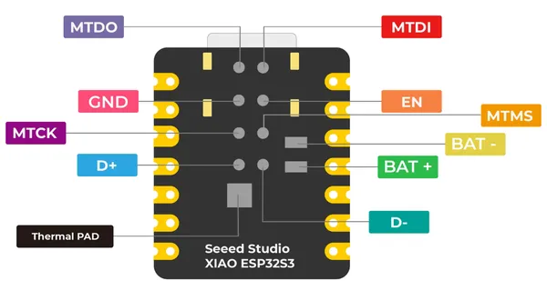

# XIAO ESP32S3 & Wio-SX1262 Kit

**Seeed Studio** · ESP32-S3

Revision: Not identified

Coverage: Pinout image collected

[Browse all manufacturers](../../../../BROWSE.md) · [Devices & IoT](../../../../DEVICES.md) · [Open in the browser guide](https://valleytech-black-wire-guide.pages.dev/?board=seeed-studio-esp32-xiao-esp32s3-wio-sx1262-kit)

## Datasheets and original documentation

Board datasheet: **not yet recorded**. Visual reference: **available**.

[Manufacturer source (recorded link)](https://wiki.seeedstudio.com/wio_sx1262_with_xiao_esp32s3_kit/)

A chip datasheet, schematic and board datasheet have different scopes. Match the exact hardware revision.

[Documentation coverage and remaining gaps](../../../../DOCUMENTATION.md)

## Pinout (Wio-SX1262)

**pinout image** · Reviewed source · PNG

[Open original reference](../../../../library/media/610def8a472927267e497ae5d4f57245975b7bdc9f8ffa046cc28f1d6b27d1c9.png)

**Credit and rights:** Not established; source attribution retained. Source/manufacturer: Seeed Studio.

[Source 1](https://files.seeedstudio.com/wiki/XIAO_ESP32S3_for_Meshtastic_LoRa/10.png) · [Source 2](https://wiki.seeedstudio.com/wio_sx1262_with_xiao_esp32s3_kit/)

Imported from existing Seeed Studio Board Reference; original working path preserved.

Image revision: Not identified

SHA-256: `610def8a472927267e497ae5d4f57245975b7bdc9f8ffa046cc28f1d6b27d1c9`

## Pinout (XIAO ESP32S3 Front)

**pinout image** · Reviewed source · PNG

[Open original reference](../../../../library/media/1bd52b116938c035ae7dfeb91f65c33935e6bc1d6b87a4aa8e1b1e62983930f4.png)

**Credit and rights:** Not established; source attribution retained. Source/manufacturer: Seeed Studio.

[Source 1](https://files.seeedstudio.com/wiki/XIAO_ESP32S3_for_Meshtastic_LoRa/13.png) · [Source 2](https://wiki.seeedstudio.com/wio_sx1262_with_xiao_esp32s3_kit/)

Imported from existing Seeed Studio Board Reference; original working path preserved.

Image revision: Not identified

SHA-256: `1bd52b116938c035ae7dfeb91f65c33935e6bc1d6b87a4aa8e1b1e62983930f4`

## Hardware Overview (XIAO ESP32S3 Back)

**source reference** · Unreviewed source · PNG

[Open original reference](../../../../library/media/8630069b70e5d9152507e59b0faa0c6481de36e5a3c39924471ea02a270ba404.png)

**Credit and rights:** Source rights not yet established. Source/manufacturer: Seeed Studio.

[Source 1](https://files.seeedstudio.com/wiki/SeeedStudio-XIAO-ESP32S3/img/back-indication.png) · [Source 2](https://wiki.seeedstudio.com/wio_sx1262_with_xiao_esp32s3_kit/)

Original source index: Hardware Overview (XIAO ESP32S3 Back). This file is searchable but has not been promoted to a reviewed physical board pinout.

Image revision: Not identified

SHA-256: `8630069b70e5d9152507e59b0faa0c6481de36e5a3c39924471ea02a270ba404`

Pin assignments have not been independently electrically verified. Check board revision before wiring.
