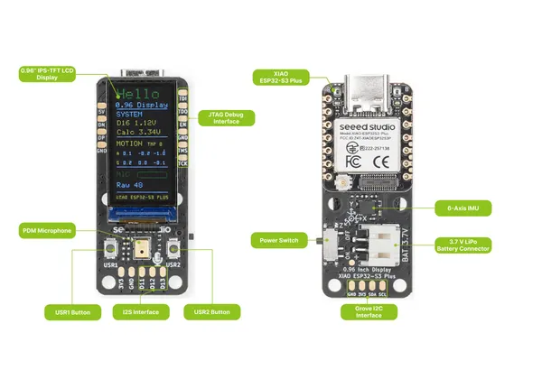

# XIAO 0.96inch IPS Display (ESP32S3)

**Seeed Studio** · ESP32

Revision: Unverified source identity  
Coverage: Source collection; review pending

[Browse all manufacturers](../../../../BROWSE.md) · [Desktop app](https://github.com/valleytechsolutions/black-wire-desktop)

## Hardware Overview

**source reference** · Unreviewed source · PNG

[Open original reference](../../../../library/media/77e59352ef06c4892d976ac5817e29c259cc65dfe85b8c572ca23475c00abc3d.png)

**Credit and rights:** Source rights not yet established. Source/manufacturer: Seeed Studio.

[Source 1](https://files.seeedstudio.com/wiki/Display_Gadgets/imgs/096_ESP32S3Plus_display_hardware_overviewNEW.png) · [Source 2](https://wiki.seeedstudio.com/getting_started_0.96_inch_display_esp32s3/)

Original source index: Hardware Overview. This file is searchable but has not been promoted to a reviewed physical board pinout.

SHA-256: `77e59352ef06c4892d976ac5817e29c259cc65dfe85b8c572ca23475c00abc3d`

Pin assignments have not been independently electrically verified. Check board revision before wiring.
