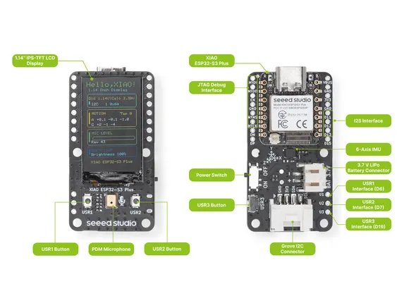

# XIAO 1.14inch IPS Display (ESP32S3)

**Seeed Studio** · ESP32

Revision: Unverified source identity

Coverage: Source collection; review pending

[Browse all manufacturers](../../../../BROWSE.md) · [Devices & IoT](../../../../DEVICES.md) · [Open in the browser guide](https://valleytech-black-wire-guide.pages.dev/?board=source-board-e7082eb182f614652b)

## Datasheets and original documentation

Board datasheet: **not yet recorded**. Visual reference: **available**.

[Manufacturer source (recorded link)](https://wiki.seeedstudio.com/getting_started_1.14_inch_display_esp32s3/)

A chip datasheet, schematic and board datasheet have different scopes. Match the exact hardware revision.

[Documentation coverage and remaining gaps](../../../../DOCUMENTATION.md)

## Hardware Overview

**source reference** · Unreviewed source · PNG

[Open original reference](../../../../library/media/164ba2042647310a1c5ce78c6aa1c297cac830c447c79b06ee357f11a231548f.png)

**Credit and rights:** Source rights not yet established. Source/manufacturer: Seeed Studio.

[Source 1](https://files.seeedstudio.com/wiki/Display_Gadgets/imgs/114_ESP32S3Plus_display_hardware_overviewNEW.png) · [Source 2](https://wiki.seeedstudio.com/getting_started_1.14_inch_display_esp32s3/)

Original source index: Hardware Overview. This file is searchable but has not been promoted to a reviewed physical board pinout.

Image revision: Not identified

SHA-256: `164ba2042647310a1c5ce78c6aa1c297cac830c447c79b06ee357f11a231548f`

Pin assignments have not been independently electrically verified. Check board revision before wiring.
