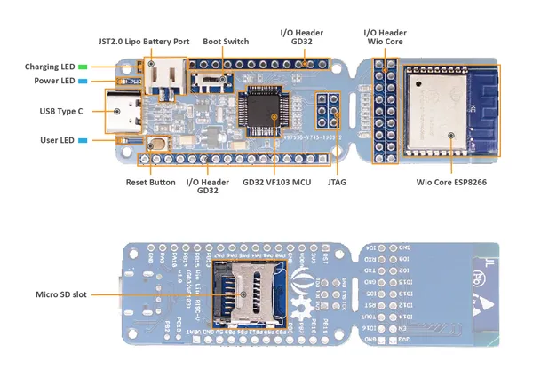

# Wio Lite RISC-V GD32VF103 with ESP8266

**Seeed Studio** · ESP8266

Revision: Unverified source identity  
Coverage: Source collection; review pending

[Browse all manufacturers](../../../../BROWSE.md) · [Desktop app](https://github.com/valleytechsolutions/black-wire-desktop)

## Hardware Overview

**source reference** · Unreviewed source · PNG

[Open original reference](../../../../library/media/a3e539cecfd2c3f0a57a8e99afb2a512c5ac3e07f32aeada99623e8426258c80.png)

**Credit and rights:** Source rights not yet established. Source/manufacturer: Seeed Studio.

[Source 1](https://files.seeedstudio.com/wiki/Wio-Lite-RISC-V-GD32VF103/img/hardware.png) · [Source 2](https://wiki.seeedstudio.com/Wio_Lite_RISC_V_GD32VF103_with_ESP8266/)

Original source index: Hardware Overview. This file is searchable but has not been promoted to a reviewed physical board pinout.

SHA-256: `a3e539cecfd2c3f0a57a8e99afb2a512c5ac3e07f32aeada99623e8426258c80`

Pin assignments have not been independently electrically verified. Check board revision before wiring.
