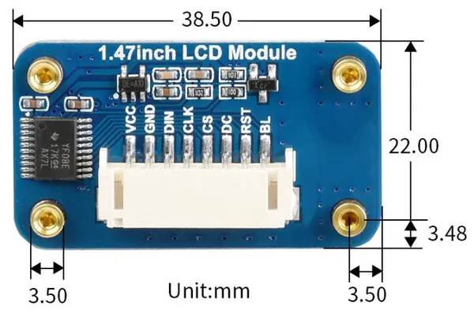

# 1.47 inch LCD SPI Display

**Seeed Studio** · Expansion

Revision: Not identified  
Coverage: Partial pinout collected; full reference still needed

[Browse all manufacturers](../../../../BROWSE.md) · [Desktop app](https://github.com/valleytechsolutions/black-wire-desktop)

## Pinout

**pinout image** · Reviewed source · PNG

[Open original reference](../../../../library/media/b8c59324844e1710e70750958a891c5212147fb9119e33fa39c0a5cb8010da56.png)

**Credit and rights:** Not established; source attribution retained. Source/manufacturer: Seeed Studio.

[Source 1](https://files.seeedstudio.com/wiki/lcd_spi_display/3.png) · [Source 2](https://wiki.seeedstudio.com/1-47inch_lcd_spi_display/)

Imported from existing Seeed Studio Board Reference; original working path preserved. Only the named connector or subsection is covered.

**Partial diagram. Confirm missing pins against the exact board documentation.**

SHA-256: `b8c59324844e1710e70750958a891c5212147fb9119e33fa39c0a5cb8010da56`

## Dimensions

**source reference** · Unreviewed source · JPG

[Open original reference](../../../../library/media/e79ecd9a23c2fa08254c242914ebfbc0dd92725b37715cd2111012af132e3722.jpg)

**Credit and rights:** Source rights not yet established. Source/manufacturer: Seeed Studio.

[Source 1](https://files.seeedstudio.com/wiki/lcd_spi_display/2.jpg) · [Source 2](https://wiki.seeedstudio.com/1-47inch_lcd_spi_display/)

Original source index: Dimensions. This file is searchable but has not been promoted to a reviewed physical board pinout.

SHA-256: `e79ecd9a23c2fa08254c242914ebfbc0dd92725b37715cd2111012af132e3722`

Pin assignments have not been independently electrically verified. Check board revision before wiring.
