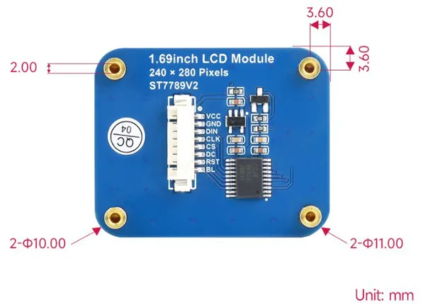
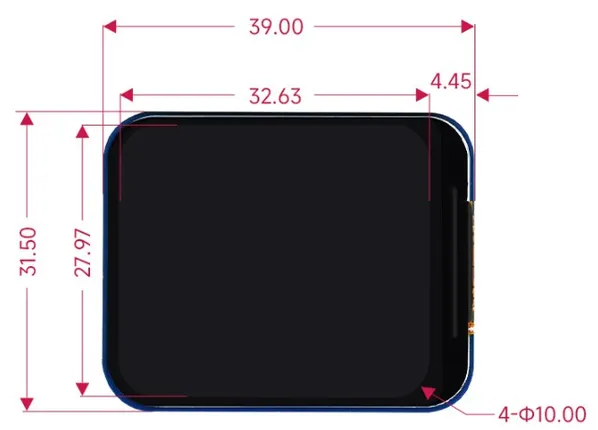

# 1.69 inch LCD SPI Display

**Seeed Studio** · Expansion

Revision: Not identified  
Coverage: Partial pinout collected; full reference still needed

[Browse all manufacturers](../../../../BROWSE.md) · [Desktop app](https://github.com/valleytechsolutions/black-wire-desktop)

## Pinout

**pinout image** · Reviewed source · PNG

[Open original reference](../../../../library/media/6cf12cad18d3b5ef3d3aca206b924c92dc7aab1175908c733ddf0819dbcf13ab.png)

**Credit and rights:** Not established; source attribution retained. Source/manufacturer: Seeed Studio.

[Source 1](https://files.seeedstudio.com/wiki/lcd_spi_display/9.png) · [Source 2](https://wiki.seeedstudio.com/1-69inch_lcd_spi_display/)

Imported from existing Seeed Studio Board Reference; original working path preserved. Only the named connector or subsection is covered.

**Partial diagram. Confirm missing pins against the exact board documentation.**

SHA-256: `6cf12cad18d3b5ef3d3aca206b924c92dc7aab1175908c733ddf0819dbcf13ab`

## Dimensions (Back)

**source reference** · Unreviewed source · JPG

[Open original reference](../../../../library/media/dc901cc1638c1ef861f76e1072294a826b01afdc64a405213937d47914d8eee8.jpg)

**Credit and rights:** Source rights not yet established. Source/manufacturer: Seeed Studio.

[Source 1](https://files.seeedstudio.com/wiki/lcd_spi_display/8.jpg) · [Source 2](https://wiki.seeedstudio.com/1-69inch_lcd_spi_display/)

Original source index: Dimensions (Back). This file is searchable but has not been promoted to a reviewed physical board pinout.

SHA-256: `dc901cc1638c1ef861f76e1072294a826b01afdc64a405213937d47914d8eee8`

## Dimensions (Front)

**source reference** · Unreviewed source · JPG

[Open original reference](../../../../library/media/00cccda21d72ee836deabcf780ee9786e0f888fd6ed98c3544251614fdab8870.jpg)

**Credit and rights:** Source rights not yet established. Source/manufacturer: Seeed Studio.

[Source 1](https://files.seeedstudio.com/wiki/lcd_spi_display/7.jpg) · [Source 2](https://wiki.seeedstudio.com/1-69inch_lcd_spi_display/)

Original source index: Dimensions (Front). This file is searchable but has not been promoted to a reviewed physical board pinout.

SHA-256: `00cccda21d72ee836deabcf780ee9786e0f888fd6ed98c3544251614fdab8870`

Pin assignments have not been independently electrically verified. Check board revision before wiring.
