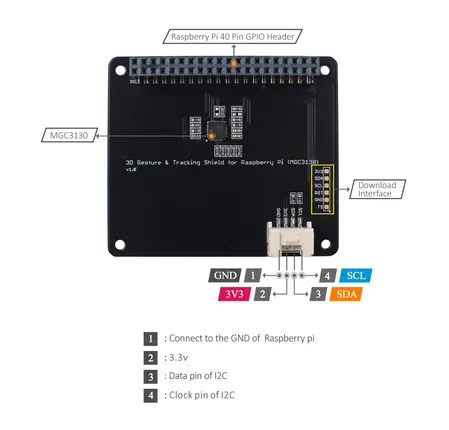

# 3D Gesture Tracking Shield for Raspberry Pi (MGC3130)

**Seeed Studio** · Expansion

Revision: Not identified  
Coverage: Partial pinout collected; full reference still needed

[Browse all manufacturers](../../../../BROWSE.md) · [Desktop app](https://github.com/valleytechsolutions/black-wire-desktop)

## Pinout

**pinout image** · Reviewed source · PNG

[Open original reference](../../../../library/media/5a84d82eaadc2ab867a38875dcd405f9c3762ef44d967330df8b5a26703cfea8.png)

**Credit and rights:** Not established; source attribution retained. Source/manufacturer: Seeed Studio.

[Source 1](https://files.seeedstudio.com/wiki/3D-Gesture-Tracking-Shield-for-Raspberry-Pi-MGC3130/img/hardware-overview.png) · [Source 2](https://wiki.seeedstudio.com/3D-Gesture-Tracking-Shield-for-Raspberry-Pi-MGC3130/)

Imported from existing Seeed Studio Board Reference; original working path preserved. Only the named connector or subsection is covered.

**Partial diagram. Confirm missing pins against the exact board documentation.**

SHA-256: `5a84d82eaadc2ab867a38875dcd405f9c3762ef44d967330df8b5a26703cfea8`

Pin assignments have not been independently electrically verified. Check board revision before wiring.
