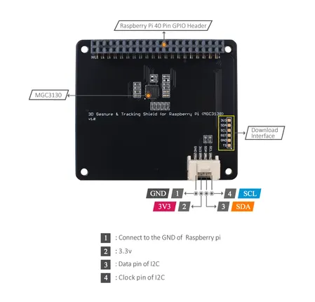

# 3D Gesture Tracking Shield for Raspberry Pi (MGC3130)

**Seeed Studio** · Expansion

Revision: Not identified

Coverage: Partial pinout collected; full reference still needed

[Browse all manufacturers](../../../../BROWSE.md) · [Devices & IoT](../../../../DEVICES.md) · [Open in the browser guide](https://valleytech-black-wire-guide.pages.dev/?board=seeed-studio-expansion-3d-gesture-tracking-shield-for-raspberry-pi-mgc3130)

## Datasheets and original documentation

Board datasheet: **not yet recorded**. Visual reference: **available**.

[Manufacturer source (recorded link)](https://wiki.seeedstudio.com/3D-Gesture-Tracking-Shield-for-Raspberry-Pi-MGC3130/)

A chip datasheet, schematic and board datasheet have different scopes. Match the exact hardware revision.

[Documentation coverage and remaining gaps](../../../../DOCUMENTATION.md)

## Pinout

**pinout image** · Reviewed source · PNG

[Open original reference](../../../../library/media/5a84d82eaadc2ab867a38875dcd405f9c3762ef44d967330df8b5a26703cfea8.png)

**Credit and rights:** Not established; source attribution retained. Source/manufacturer: Seeed Studio.

[Source 1](https://files.seeedstudio.com/wiki/3D-Gesture-Tracking-Shield-for-Raspberry-Pi-MGC3130/img/hardware-overview.png) · [Source 2](https://wiki.seeedstudio.com/3D-Gesture-Tracking-Shield-for-Raspberry-Pi-MGC3130/)

Imported from existing Seeed Studio Board Reference; original working path preserved. Only the named connector or subsection is covered.

Image revision: Not identified

SHA-256: `5a84d82eaadc2ab867a38875dcd405f9c3762ef44d967330df8b5a26703cfea8`

Pin assignments have not been independently electrically verified. Check board revision before wiring.
