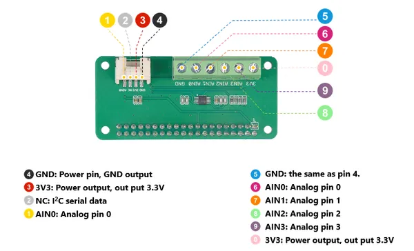
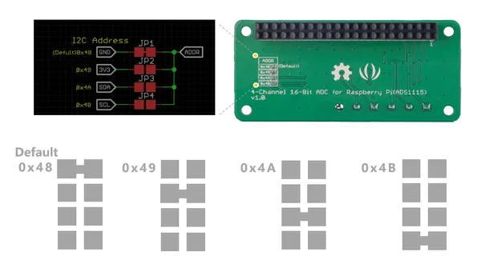

# 4-Channel 16-Bit ADC for Raspberry Pi (ADS1115)

**Seeed Studio** · Expansion

Revision: Not identified  
Coverage: Partial pinout collected; full reference still needed

[Browse all manufacturers](../../../../BROWSE.md) · [Desktop app](https://github.com/valleytechsolutions/black-wire-desktop)

## Pinout

**pinout image** · Reviewed source · PNG

[Open original reference](../../../../library/media/69c941e54faec1712326d0b0e96a29fc2d751e132bef45339e968992af03618b.png)

**Credit and rights:** Not established; source attribution retained. Source/manufacturer: Seeed Studio.

[Source 1](https://files.seeedstudio.com/wiki/4-Channel_16-Bit_ADC_for_Raspberry_Pi-ADS1115/img/pinout.png) · [Source 2](https://wiki.seeedstudio.com/4-Channel_16-Bit_ADC_for_Raspberry_Pi-ADS1115/)

Imported from existing Seeed Studio Board Reference; original working path preserved. Only the named connector or subsection is covered.

**Partial diagram. Confirm missing pins against the exact board documentation.**

SHA-256: `69c941e54faec1712326d0b0e96a29fc2d751e132bef45339e968992af03618b`

## Pin Functions

**source reference** · Unreviewed source · PNG

[Open original reference](../../../../library/media/0c7b66172d3e16f99d3395e2a1ca558e12955f83b403b47af0c1a5830ad7eac0.png)

**Credit and rights:** Source rights not yet established. Source/manufacturer: Seeed Studio.

[Source 1](https://files.seeedstudio.com/wiki/4-Channel_16-Bit_ADC_for_Raspberry_Pi-ADS1115/img/pinout1.png) · [Source 2](https://wiki.seeedstudio.com/4-Channel_16-Bit_ADC_for_Raspberry_Pi-ADS1115/)

Original source index: Pin Functions. This file is searchable but has not been promoted to a reviewed physical board pinout.

SHA-256: `0c7b66172d3e16f99d3395e2a1ca558e12955f83b403b47af0c1a5830ad7eac0`

Pin assignments have not been independently electrically verified. Check board revision before wiring.
