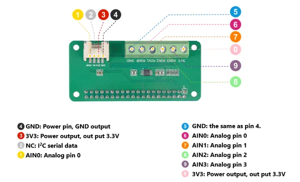
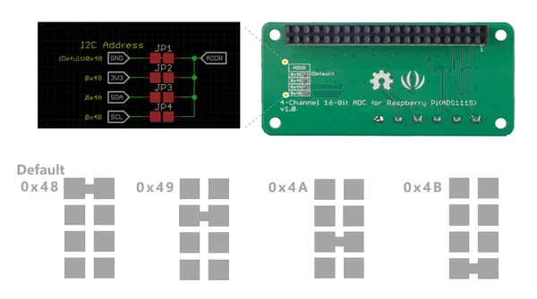

# 4-Channel 16-Bit ADC for Raspberry Pi (ADS1115)

**Seeed Studio** · Expansion

Revision: Not identified

Coverage: Partial connector source collected; full-device review pending

[Browse all manufacturers](../../../../BROWSE.md) · [Devices & IoT](../../../../DEVICES.md) · [Open in the browser guide](https://valleytech-black-wire-guide.pages.dev/?board=seeed-studio-expansion-4-channel-16-bit-adc-for-raspberry-pi-ads1115)

## Datasheets and original documentation

Board datasheet: **not yet recorded**. Visual reference: **available**.

[Manufacturer source (recorded link)](https://wiki.seeedstudio.com/4-Channel_16-Bit_ADC_for_Raspberry_Pi-ADS1115/)

A chip datasheet, schematic and board datasheet have different scopes. Match the exact hardware revision.

[Documentation coverage and remaining gaps](../../../../DOCUMENTATION.md)

## Pinout

**pinout image** · Connector diagram visually inspected; independent electrical review pending · PNG

[Open original reference](../../../../library/media/69c941e54faec1712326d0b0e96a29fc2d751e132bef45339e968992af03618b.png)

**Credit and rights:** Not established; source attribution retained. Source/manufacturer: Seeed Studio.

[Source 1](https://files.seeedstudio.com/wiki/4-Channel_16-Bit_ADC_for_Raspberry_Pi-ADS1115/img/pinout.png) · [Source 2](https://wiki.seeedstudio.com/4-Channel_16-Bit_ADC_for_Raspberry_Pi-ADS1115/)

Physical connector/pad source reference. Only the connections shown are covered; source conflicts and exact revision still require technical review.

Image revision: Not identified

SHA-256: `69c941e54faec1712326d0b0e96a29fc2d751e132bef45339e968992af03618b`

## Pin Functions

**pinout image** · Connector diagram visually inspected; independent electrical review pending · PNG

[Open original reference](../../../../library/media/0c7b66172d3e16f99d3395e2a1ca558e12955f83b403b47af0c1a5830ad7eac0.png)

**Credit and rights:** Source rights not yet established. Source/manufacturer: Seeed Studio.

[Source 1](https://files.seeedstudio.com/wiki/4-Channel_16-Bit_ADC_for_Raspberry_Pi-ADS1115/img/pinout1.png) · [Source 2](https://wiki.seeedstudio.com/4-Channel_16-Bit_ADC_for_Raspberry_Pi-ADS1115/)

Physical connector/pad source reference. Only the connections shown are covered; source conflicts and exact revision still require technical review.

Image revision: Not identified

SHA-256: `0c7b66172d3e16f99d3395e2a1ca558e12955f83b403b47af0c1a5830ad7eac0`

Pin assignments have not been independently electrically verified. Check board revision before wiring.
