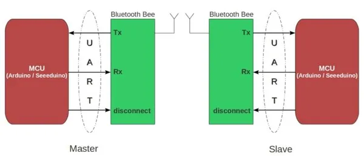

# Bluetooth Bee

**Seeed Studio** · Expansion

Revision: Not identified  
Coverage: Pinout image collected

[Browse all manufacturers](../../../../BROWSE.md) · [Desktop app](https://github.com/valleytechsolutions/black-wire-desktop)

## Pinout

**pinout image** · Reviewed source · JPG

[Open original reference](../../../../library/media/3e2d762a2855ad3f0ba70dcb8f1031e23dde345f74d424f475c95f26ac06bc8e.jpg)

**Credit and rights:** Not established; source attribution retained. Source/manufacturer: Seeed Studio.

[Source 1](https://files.seeedstudio.com/wiki/Bluetooth-Bee/img/Bluetooth-pin.jpg) · [Source 2](https://wiki.seeedstudio.com/Bluetooth_Bee/)

Imported from existing Seeed Studio Board Reference; original working path preserved.

SHA-256: `3e2d762a2855ad3f0ba70dcb8f1031e23dde345f74d424f475c95f26ac06bc8e`

## Block Diagram

**source reference** · Unreviewed source · JPG

[Open original reference](../../../../library/media/39fddd9fb526e34a4d90d89ea340576346fc2fbe3d530f8dde066455b06b3d72.jpg)

**Credit and rights:** Source rights not yet established. Source/manufacturer: Seeed Studio.

[Source 1](https://files.seeedstudio.com/wiki/Bluetooth-Bee/img/Bluetooth-1.jpg) · [Source 2](https://wiki.seeedstudio.com/Bluetooth_Bee/)

Original source index: Block Diagram. This file is searchable but has not been promoted to a reviewed physical board pinout.

SHA-256: `39fddd9fb526e34a4d90d89ea340576346fc2fbe3d530f8dde066455b06b3d72`

Pin assignments have not been independently electrically verified. Check board revision before wiring.
