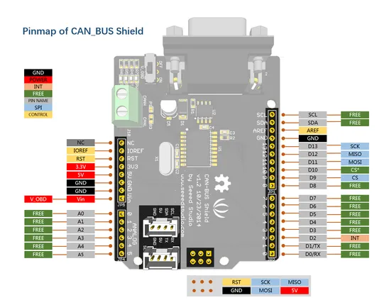
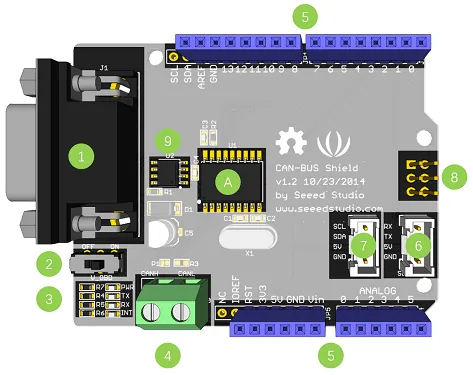
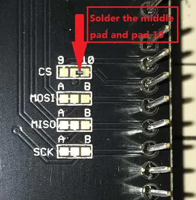

# CAN-BUS Shield V1.2

**Seeed Studio** · Expansion

Revision: Not identified  
Coverage: Pinout image collected

[Browse all manufacturers](../../../../BROWSE.md) · [Desktop app](https://github.com/valleytechsolutions/black-wire-desktop)

## Pinout

**pinout image** · Reviewed source · PNG

[Open original reference](../../../../library/media/c69c4e9d3a6ead96d4a424b6094d288b77785efa7dce1461adb899a6204df2c9.png)

**Credit and rights:** Not established; source attribution retained. Source/manufacturer: Seeed Studio.

[Source 1](https://files.seeedstudio.com/wiki/CAN_BUS_Shield/image/PINMAP.png) · [Source 2](https://wiki.seeedstudio.com/CAN-BUS_Shield_V1.2/)

Imported from existing Seeed Studio Board Reference; original working path preserved.

SHA-256: `c69c4e9d3a6ead96d4a424b6094d288b77785efa7dce1461adb899a6204df2c9`

## Hardware Overview

**source reference** · Unreviewed source · PNG

[Open original reference](../../../../library/media/ceb190f51244f8643bd7d32ccd02ebff09e15844394adfdb2eadbc1b5f634f71.png)

**Credit and rights:** Source rights not yet established. Source/manufacturer: Seeed Studio.

[Source 1](https://files.seeedstudio.com/wiki/CAN_BUS_Shield/image/hardware_overview_1.png) · [Source 2](https://wiki.seeedstudio.com/CAN-BUS_Shield_V1.2/)

Original source index: Hardware Overview. This file is searchable but has not been promoted to a reviewed physical board pinout.

SHA-256: `ceb190f51244f8643bd7d32ccd02ebff09e15844394adfdb2eadbc1b5f634f71`

## Pin Multiplexing (SPI CS Select)

**source reference** · Unreviewed source · PNG

[Open original reference](../../../../library/media/b0003f6549515d47ab88fe57dc67afec8f0ee984571f57c47af74adec638962e.png)

**Credit and rights:** Source rights not yet established. Source/manufacturer: Seeed Studio.

[Source 1](https://files.seeedstudio.com/wiki/CAN_BUS_Shield/image/sodder%20the%20middle%20pad%20and%20pad%2010.png) · [Source 2](https://wiki.seeedstudio.com/CAN-BUS_Shield_V1.2/)

Original source index: Pin Multiplexing (SPI CS Select). This file is searchable but has not been promoted to a reviewed physical board pinout.

SHA-256: `b0003f6549515d47ab88fe57dc67afec8f0ee984571f57c47af74adec638962e`

Pin assignments have not been independently electrically verified. Check board revision before wiring.
