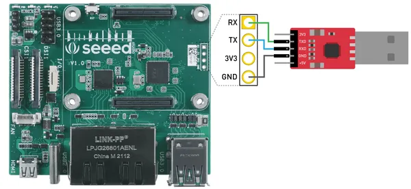
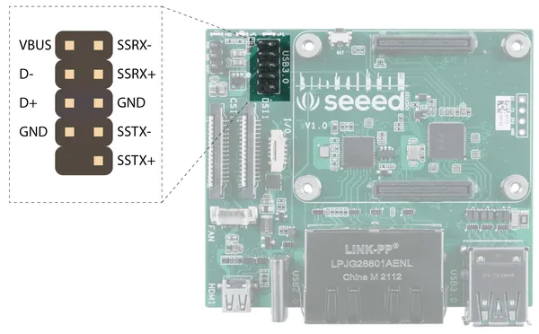
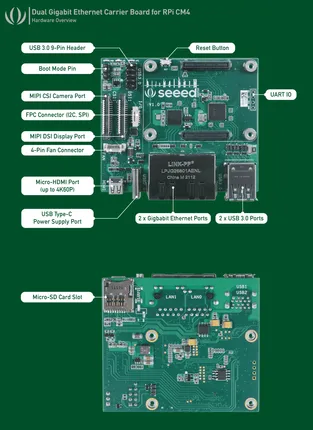
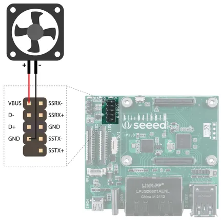

# Dual Gigabit Ethernet Carrier Board for Raspberry Pi CM4

**Seeed Studio** · Expansion

Revision: Not identified  
Coverage: Partial pinout collected; full reference still needed

[Browse all manufacturers](../../../../BROWSE.md) · [Desktop app](https://github.com/valleytechsolutions/black-wire-desktop)

## Pinout (Boot Pins)

**pinout image** · Reviewed source · PNG

[Open original reference](../../../../library/media/9fc6eb742335e369409920538aa2754400854d96b11ddd0d20dcd4c35fe3bbfa.png)

**Credit and rights:** Not established; source attribution retained. Source/manufacturer: Seeed Studio.

[Source 1](https://files.seeedstudio.com/wiki/102110497/latest-board/boot-pins.png) · [Source 2](https://wiki.seeedstudio.com/Dual-Gigabit-Ethernet-Carrier-Board-for-Raspberry-Pi-CM4/)

Imported from existing Seeed Studio Board Reference; original working path preserved. Only the named connector or subsection is covered.

**Partial diagram. Confirm missing pins against the exact board documentation.**

SHA-256: `9fc6eb742335e369409920538aa2754400854d96b11ddd0d20dcd4c35fe3bbfa`

## Pinout (UART Header)

**pinout image** · Reviewed source · PNG

[Open original reference](../../../../library/media/dc85f40608dcfb715c4b5c36329a30c2f65fb39ff76d36abba01cb273123d395.png)

**Credit and rights:** Not established; source attribution retained. Source/manufacturer: Seeed Studio.

[Source 1](https://files.seeedstudio.com/wiki/102110497/latest-board/UART.png) · [Source 2](https://wiki.seeedstudio.com/Dual-Gigabit-Ethernet-Carrier-Board-for-Raspberry-Pi-CM4/)

Imported from existing Seeed Studio Board Reference; original working path preserved. Only the named connector or subsection is covered.

**Partial diagram. Confirm missing pins against the exact board documentation.**

SHA-256: `dc85f40608dcfb715c4b5c36329a30c2f65fb39ff76d36abba01cb273123d395`

## Pinout (USB 3.0 Header)

**pinout image** · Reviewed source · JPG

[Open original reference](../../../../library/media/271b58517a15922f3a393f25955b76adf694e59d9d5ea070a1b2b4b542da523f.jpg)

**Credit and rights:** Not established; source attribution retained. Source/manufacturer: Seeed Studio.

[Source 1](https://files.seeedstudio.com/wiki/102110497/latest-board/USB-pins.jpg) · [Source 2](https://wiki.seeedstudio.com/Dual-Gigabit-Ethernet-Carrier-Board-for-Raspberry-Pi-CM4/)

Imported from existing Seeed Studio Board Reference; original working path preserved. Only the named connector or subsection is covered.

**Partial diagram. Confirm missing pins against the exact board documentation.**

SHA-256: `271b58517a15922f3a393f25955b76adf694e59d9d5ea070a1b2b4b542da523f`

## Hardware Overview

**source reference** · Unreviewed source · PNG

[Open original reference](../../../../library/media/d5156c93de2257a08b258f45ec7c8bf1bd3155867517b1ffc8714733d75bae93.png)

**Credit and rights:** Source rights not yet established. Source/manufacturer: Seeed Studio.

Original source index: Hardware Overview. This file is searchable but has not been promoted to a reviewed physical board pinout.

SHA-256: `d5156c93de2257a08b258f45ec7c8bf1bd3155867517b1ffc8714733d75bae93`

## Pinout (Fan Connector)

**source reference** · Unreviewed source · JPG

[Open original reference](../../../../library/media/d8346d3362737d65b8bd831c33503f22b5511fa84d96a04cef81a28e117dc13e.jpg)

**Credit and rights:** Source rights not yet established. Source/manufacturer: Seeed Studio.

Original source index: Pinout (Fan Connector). This file is searchable but has not been promoted to a reviewed physical board pinout.

SHA-256: `d8346d3362737d65b8bd831c33503f22b5511fa84d96a04cef81a28e117dc13e`

Pin assignments have not been independently electrically verified. Check board revision before wiring.
