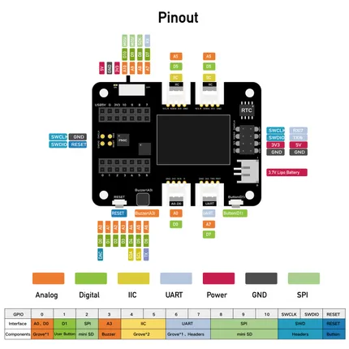
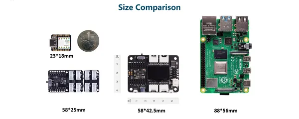
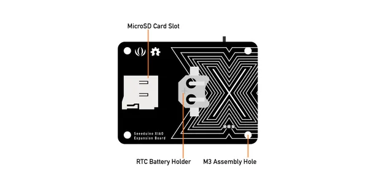
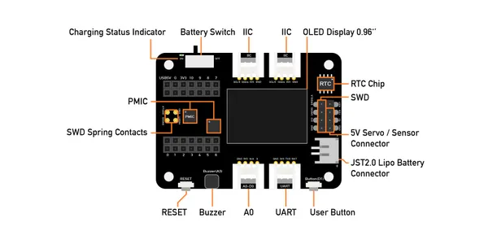
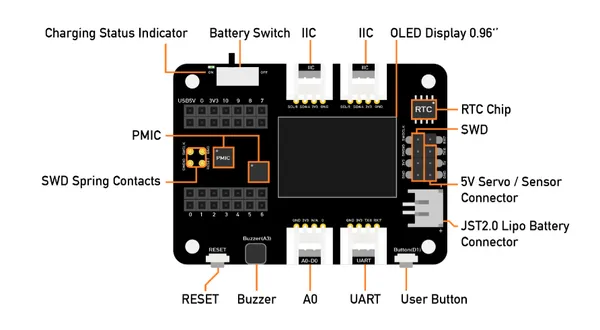

# Expansion Board Base for XIAO

**Seeed Studio** · Expansion

Revision: Not identified  
Coverage: Pinout image collected

[Browse all manufacturers](../../../../BROWSE.md) · [Desktop app](https://github.com/valleytechsolutions/black-wire-desktop)

## Pinout

**pinout image** · Reviewed source · JPG

[Open original reference](../../../../library/media/daa59ba0e33be1629b30893f0e2302899bcf44897f76bf35cfaae3ba18567d2a.jpg)

**Credit and rights:** Not established; source attribution retained. Source/manufacturer: Seeed Studio.

[Source 1](https://files.seeedstudio.com/wiki/Seeeduino-XIAO-Expansion-Board/Update_pic/pinpinpin4.jpg) · [Source 2](https://wiki.seeedstudio.com/Seeeduino-XIAO-Expansion-Board/)

Imported from existing Seeed Studio Board Reference; original working path preserved.

SHA-256: `daa59ba0e33be1629b30893f0e2302899bcf44897f76bf35cfaae3ba18567d2a`

## Dimensions

**source reference** · Unreviewed source · PNG

[Open original reference](../../../../library/media/b035a907cbe8dc7928b0dc2dd7b0b79801a590a18b68484bf58a8a4407ac172c.png)

**Credit and rights:** Source rights not yet established. Source/manufacturer: Seeed Studio.

[Source 1](https://files.seeedstudio.com/wiki/Seeeduino-XIAO-Expansion-Board/Update_pic/ssssssssssccccccccc.png) · [Source 2](https://wiki.seeedstudio.com/Seeeduino-XIAO-Expansion-Board/)

Original source index: Dimensions. This file is searchable but has not been promoted to a reviewed physical board pinout.

SHA-256: `b035a907cbe8dc7928b0dc2dd7b0b79801a590a18b68484bf58a8a4407ac172c`

## Hardware Overview (Back)

**source reference** · Unreviewed source · JPG

[Open original reference](../../../../library/media/1f8adb0a0a6027fecc22ce9be46ca2661848d805b95ab96dcef206c4d29ef67d.jpg)

**Credit and rights:** Source rights not yet established. Source/manufacturer: Seeed Studio.

[Source 1](https://files.seeedstudio.com/wiki/Seeeduino-XIAO-Expansion-Board/1111111111111111111111110.jpg) · [Source 2](https://wiki.seeedstudio.com/Seeeduino-XIAO-Expansion-Board/)

Original source index: Hardware Overview (Back). This file is searchable but has not been promoted to a reviewed physical board pinout.

SHA-256: `1f8adb0a0a6027fecc22ce9be46ca2661848d805b95ab96dcef206c4d29ef67d`

## Hardware Overview (Front)

**source reference** · Unreviewed source · JPG

[Open original reference](../../../../library/media/2fb2b2c6ce7f51f89104f30d2a5ff849c139443c3fd16d93413cd6e57165a1fd.jpg)

**Credit and rights:** Source rights not yet established. Source/manufacturer: Seeed Studio.

[Source 1](https://files.seeedstudio.com/wiki/Seeeduino-XIAO-Expansion-Board/2222222222222222222222222222221.jpg) · [Source 2](https://wiki.seeedstudio.com/Seeeduino-XIAO-Expansion-Board/)

Original source index: Hardware Overview (Front). This file is searchable but has not been promoted to a reviewed physical board pinout.

SHA-256: `2fb2b2c6ce7f51f89104f30d2a5ff849c139443c3fd16d93413cd6e57165a1fd`

## Hardware Overview

**source reference** · Unreviewed source · PNG

[Open original reference](../../../../library/media/c5bd3092f3e65fc02c820ad4e99c85368a1d7ee8accd5f137c86676ec3e82569.png)

**Credit and rights:** Source rights not yet established. Source/manufacturer: Seeed Studio.

[Source 1](https://files.seeedstudio.com/wiki/wiki-ranger/Contributions/C3-ESPHome-full_function/29.png) · [Source 2](https://wiki.seeedstudio.com/XIAO-nRF52840-Zephyr-RTOS/)

Original source index: Hardware Overview. This file is searchable but has not been promoted to a reviewed physical board pinout.

SHA-256: `c5bd3092f3e65fc02c820ad4e99c85368a1d7ee8accd5f137c86676ec3e82569`

Pin assignments have not been independently electrically verified. Check board revision before wiring.
