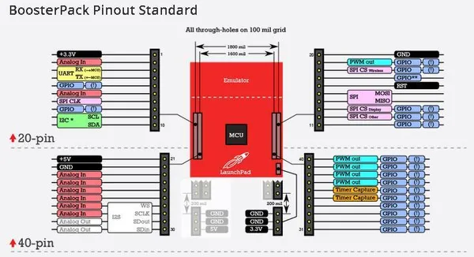

# Grove Base BoosterPack

**Seeed Studio** · Expansion

Revision: Not identified  
Coverage: Pinout image collected

[Browse all manufacturers](../../../../BROWSE.md) · [Desktop app](https://github.com/valleytechsolutions/black-wire-desktop)

## Pinout

**pinout image** · Reviewed source · JPG

[Open original reference](../../../../library/media/f6f69b0b5e5a77e7dbb6bcd4dc6fc393b3fb9721825ce3a0b183fb210b84ccd8.jpg)

**Credit and rights:** Not established; source attribution retained. Source/manufacturer: Seeed Studio.

[Source 1](https://files.seeedstudio.com/wiki/Grove_Base_BoosterPack/img/BoosterpackpinMapping.jpg) · [Source 2](https://wiki.seeedstudio.com/Grove_Base_BoosterPack/)

Imported from existing Seeed Studio Board Reference; original working path preserved.

SHA-256: `f6f69b0b5e5a77e7dbb6bcd4dc6fc393b3fb9721825ce3a0b183fb210b84ccd8`

Pin assignments have not been independently electrically verified. Check board revision before wiring.
