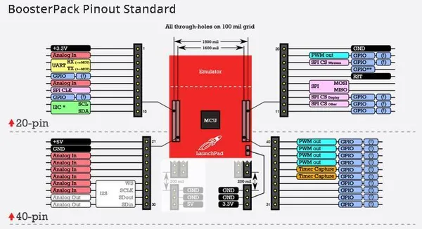

# Grove Base BoosterPack

**Seeed Studio** · Expansion

Revision: Not identified

Coverage: Partial connector source collected; full-device review pending

[Browse all manufacturers](../../../../BROWSE.md) · [Devices & IoT](../../../../DEVICES.md) · [Open in the browser guide](https://valleytech-black-wire-guide.pages.dev/?board=seeed-studio-expansion-grove-base-boosterpack)

## Datasheets and original documentation

Board datasheet: **not yet recorded**. Visual reference: **available**.

[Manufacturer source (recorded link)](https://wiki.seeedstudio.com/Grove_Base_BoosterPack/)

A chip datasheet, schematic and board datasheet have different scopes. Match the exact hardware revision.

[Documentation coverage and remaining gaps](../../../../DOCUMENTATION.md)

## Pinout

**pinout image** · Connector diagram visually inspected; independent electrical review pending · JPG

[Open original reference](../../../../library/media/f6f69b0b5e5a77e7dbb6bcd4dc6fc393b3fb9721825ce3a0b183fb210b84ccd8.jpg)

**Credit and rights:** Not established; source attribution retained. Source/manufacturer: Seeed Studio.

[Source 1](https://files.seeedstudio.com/wiki/Grove_Base_BoosterPack/img/BoosterpackpinMapping.jpg) · [Source 2](https://wiki.seeedstudio.com/Grove_Base_BoosterPack/)

Physical connector/pad source reference. Only the connections shown are covered; source conflicts and exact revision still require technical review.

Image revision: Not identified

SHA-256: `f6f69b0b5e5a77e7dbb6bcd4dc6fc393b3fb9721825ce3a0b183fb210b84ccd8`

Pin assignments have not been independently electrically verified. Check board revision before wiring.
