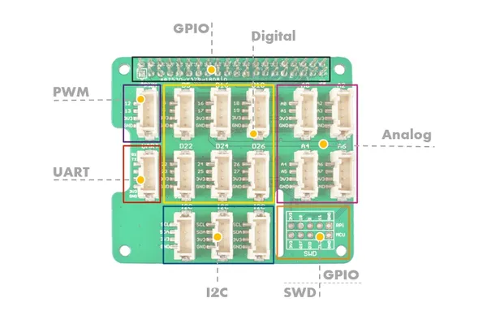

# Grove Base Hat for Raspberry Pi

**Seeed Studio** · Expansion

Revision: Not identified  
Coverage: Board labels only; pinout needed

[Browse all manufacturers](../../../../BROWSE.md) · [Desktop app](https://github.com/valleytechsolutions/black-wire-desktop)

## Pinout

**board labeling image** · Reviewed source · JPG

[Open original reference](../../../../library/media/33654fda8f571701973efda985034f50b8204808fe0eb9694461ef488ecb723b.jpg)

**Credit and rights:** Not established; source attribution retained. Source/manufacturer: Seeed Studio.

[Source 1](https://files.seeedstudio.com/wiki/Grove_Base_Hat_for_Raspberry_Pi/img/pin-out/overview.jpg) · [Source 2](https://wiki.seeedstudio.com/Grove_Base_Hat_for_Raspberry_Pi/)

Imported from existing Seeed Studio Board Reference; original working path preserved.

SHA-256: `33654fda8f571701973efda985034f50b8204808fe0eb9694461ef488ecb723b`

Pin assignments have not been independently electrically verified. Check board revision before wiring.
