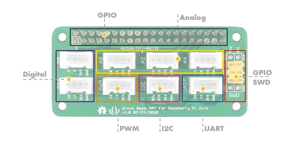

# Grove Base Hat for Raspberry Pi Zero

**Seeed Studio** · Expansion

Revision: Not identified

Coverage: Board labels only; pinout needed

[Browse all manufacturers](../../../../BROWSE.md) · [Devices & IoT](../../../../DEVICES.md) · [Open in the browser guide](https://valleytech-black-wire-guide.pages.dev/?board=seeed-studio-expansion-grove-base-hat-for-raspberry-pi-zero)

## Datasheets and original documentation

Board datasheet: **not yet recorded**. Visual reference: **available**.

[Manufacturer source (recorded link)](https://wiki.seeedstudio.com/Grove_Base_Hat_for_Raspberry_Pi_Zero/)

A chip datasheet, schematic and board datasheet have different scopes. Match the exact hardware revision.

[Documentation coverage and remaining gaps](../../../../DOCUMENTATION.md)

## Pinout

**board labeling image** · Reviewed source · JPG

[Open original reference](../../../../library/media/40ccae7bcc3a41d5cf83abcf07185d5013c915ae5a063e2a6b49bcd2177de5de.jpg)

**Credit and rights:** Not established; source attribution retained. Source/manufacturer: Seeed Studio.

[Source 1](https://files.seeedstudio.com/wiki/Grove_Base_Hat_for_Raspberry_Pi_Zero/img/pin-out/overview.jpg) · [Source 2](https://wiki.seeedstudio.com/Grove_Base_Hat_for_Raspberry_Pi_Zero/)

Imported from existing Seeed Studio Board Reference; original working path preserved.

Image revision: Not identified

SHA-256: `40ccae7bcc3a41d5cf83abcf07185d5013c915ae5a063e2a6b49bcd2177de5de`

Pin assignments have not been independently electrically verified. Check board revision before wiring.
