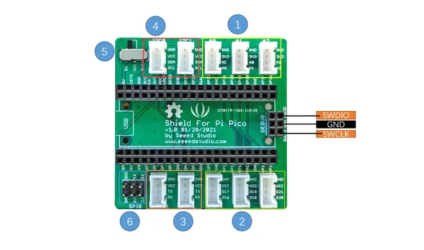

# Grove Basic Kit for Raspberry Pi Pico

**Seeed Studio** · Expansion

Revision: Not identified  
Coverage: Board labels only; pinout needed

[Browse all manufacturers](../../../../BROWSE.md) · [Desktop app](https://github.com/valleytechsolutions/black-wire-desktop)

## Pinout

**board labeling image** · Reviewed source · PNG

[Open original reference](../../../../library/media/103a2bfabefd52a7e57bd5d3903abd4a5900c1728ce32bdd6e248cff47e77579.png)

**Credit and rights:** Not established; source attribution retained. Source/manufacturer: Seeed Studio.

[Source 1](https://files.seeedstudio.com/wiki/Grove_Shield_for_Pi_Pico_V1.0/Pico_hardware.png) · [Source 2](https://wiki.seeedstudio.com/Grove-Starter-Kit-for-Raspberry-Pi-Pico/)

Imported from existing Seeed Studio Board Reference; original working path preserved.

SHA-256: `103a2bfabefd52a7e57bd5d3903abd4a5900c1728ce32bdd6e248cff47e77579`

## Hardware Overview

**source reference** · Unreviewed source · PNG

[Open original reference](../../../../library/media/05cdc51f97dc78851397454c14ab37a75f0a361b27f6b654cb7e39ee55e96c25.png)

**Credit and rights:** Source rights not yet established. Source/manufacturer: Seeed Studio.

[Source 1](https://files.seeedstudio.com/wiki/Grove_Shield_for_Pi_Pico_V1.0/hardwareoverview.png) · [Source 2](https://wiki.seeedstudio.com/Grove-Starter-Kit-for-Raspberry-Pi-Pico/)

Original source index: Hardware Overview. This file is searchable but has not been promoted to a reviewed physical board pinout.

SHA-256: `05cdc51f97dc78851397454c14ab37a75f0a361b27f6b654cb7e39ee55e96c25`

Pin assignments have not been independently electrically verified. Check board revision before wiring.
