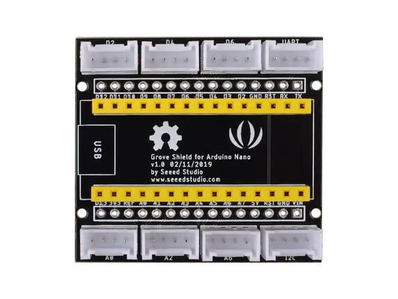

# Grove Shield for Arduino Nano

**Seeed Studio** · Expansion

Revision: Not identified  
Coverage: Board labels only; pinout needed

[Browse all manufacturers](../../../../BROWSE.md) · [Desktop app](https://github.com/valleytechsolutions/black-wire-desktop)

## Pinout (Back)

**board labeling image** · Reviewed source · JPG

[Open original reference](../../../../library/media/46e99c66ddfb0b1891833ca05a88bb778a47452bc1dc86b3513ec35ba0b432e6.jpg)

**Credit and rights:** Not established; source attribution retained. Source/manufacturer: Seeed Studio.

[Source 1](https://files.seeedstudio.com/wiki/Grove-shield-for-Arduino-Nano/img/Grove-Shoeld-for-Arduino-Nano-back-rr.jpg) · [Source 2](https://wiki.seeedstudio.com/Grove_Shield_for_Arduino_Nano/)

Imported from existing Seeed Studio Board Reference; original working path preserved.

SHA-256: `46e99c66ddfb0b1891833ca05a88bb778a47452bc1dc86b3513ec35ba0b432e6`

## Pinout (Front)

**board labeling image** · Reviewed source · PNG

[Open original reference](../../../../library/media/bda84079d11b1786526a8fd95b179005b98b15813fbc133935555ee6a8b32ac9.png)

**Credit and rights:** Not established; source attribution retained. Source/manufacturer: Seeed Studio.

[Source 1](https://files.seeedstudio.com/wiki/Grove-shield-for-Arduino-Nano/img/Grove-Shoeld-for-Arduino-Nano-front.png) · [Source 2](https://wiki.seeedstudio.com/Grove_Shield_for_Arduino_Nano/)

Imported from existing Seeed Studio Board Reference; original working path preserved.

SHA-256: `bda84079d11b1786526a8fd95b179005b98b15813fbc133935555ee6a8b32ac9`

Pin assignments have not been independently electrically verified. Check board revision before wiring.
