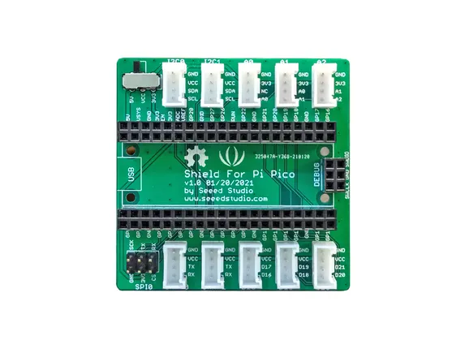

# Grove Shield for Pi Pico V1.0

**Seeed Studio** · Expansion

Revision: Not identified

Coverage: Board labels only; pinout needed

[Browse all manufacturers](../../../../BROWSE.md) · [Devices & IoT](../../../../DEVICES.md) · [Open in the browser guide](https://valleytech-black-wire-guide.pages.dev/?board=seeed-studio-expansion-grove-shield-for-pi-pico-v1-0)

## Datasheets and original documentation

Board datasheet: **not yet recorded**. Visual reference: **available**.

[Manufacturer source (recorded link)](https://wiki.seeedstudio.com/Grove-Starter-Kit-for-Raspberry-Pi-Pico/)

A chip datasheet, schematic and board datasheet have different scopes. Match the exact hardware revision.

[Documentation coverage and remaining gaps](../../../../DOCUMENTATION.md)

## Pinout

**board labeling image** · Reviewed source · PNG

[Open original reference](../../../../library/media/103a2bfabefd52a7e57bd5d3903abd4a5900c1728ce32bdd6e248cff47e77579.png)

**Credit and rights:** Not established; source attribution retained. Source/manufacturer: Seeed Studio.

[Source 1](https://files.seeedstudio.com/wiki/Grove_Shield_for_Pi_Pico_V1.0/Pico_hardware.png) · [Source 2](https://wiki.seeedstudio.com/Grove-Starter-Kit-for-Raspberry-Pi-Pico/)

Imported from existing Seeed Studio Board Reference; original working path preserved.

Image revision: Not identified

SHA-256: `103a2bfabefd52a7e57bd5d3903abd4a5900c1728ce32bdd6e248cff47e77579`

Pin assignments have not been independently electrically verified. Check board revision before wiring.
