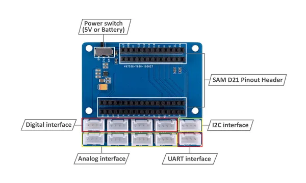

# Grove Shield for Wio Lite

**Seeed Studio** · Expansion

Revision: Not identified  
Coverage: Board labels only; pinout needed

[Browse all manufacturers](../../../../BROWSE.md) · [Desktop app](https://github.com/valleytechsolutions/black-wire-desktop)

## Pinout

**board labeling image** · Reviewed source · JPG

[Open original reference](../../../../library/media/4048bbbc72ddb62653d7cf1d85effddc65cdfe72a5fd8f4cdd4b1148bd5f9f0c.jpg)

**Credit and rights:** Not established; source attribution retained. Source/manufacturer: Seeed Studio.

[Source 1](https://files.seeedstudio.com/wiki/Grove-Shield-for-Wio-Lite/img/wiki-pinout.jpg) · [Source 2](https://wiki.seeedstudio.com/Grove-Shield-for-Wio-Lite/)

Imported from existing Seeed Studio Board Reference; original working path preserved.

SHA-256: `4048bbbc72ddb62653d7cf1d85effddc65cdfe72a5fd8f4cdd4b1148bd5f9f0c`

## Hardware Overview

**source reference** · Unreviewed source · JPG

[Open original reference](../../../../library/media/8131d21cbe44291267571c5235eaa7998e19644f75447364e83e91cd1fc16198.jpg)

**Credit and rights:** Source rights not yet established. Source/manufacturer: Seeed Studio.

[Source 1](https://files.seeedstudio.com/wiki/Grove-Shield-for-Wio-Lite/img/Grove-Shield-for-Wio-Lite-V1.0.jpg) · [Source 2](https://wiki.seeedstudio.com/Grove-Shield-for-Wio-Lite/)

Original source index: Hardware Overview. This file is searchable but has not been promoted to a reviewed physical board pinout.

SHA-256: `8131d21cbe44291267571c5235eaa7998e19644f75447364e83e91cd1fc16198`

Pin assignments have not been independently electrically verified. Check board revision before wiring.
